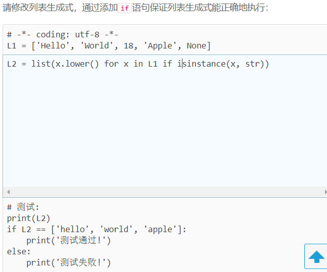
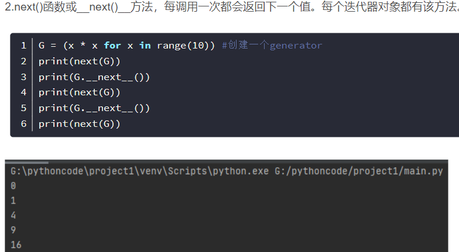
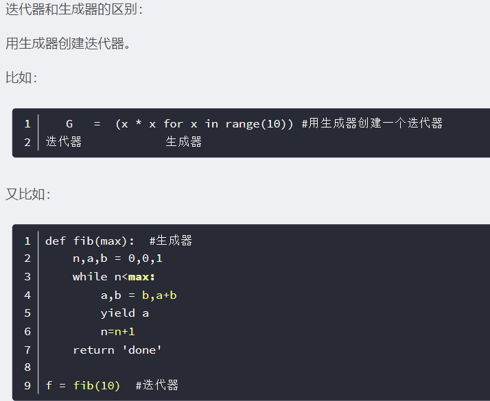
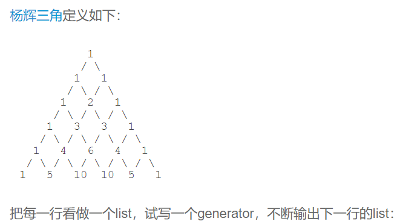
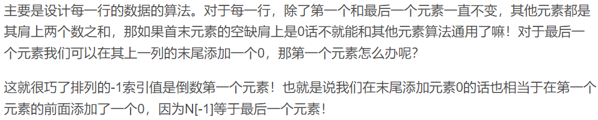
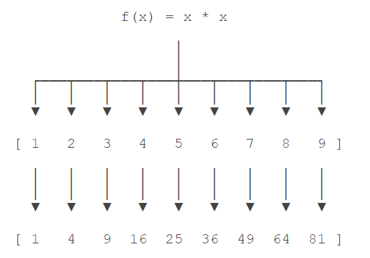
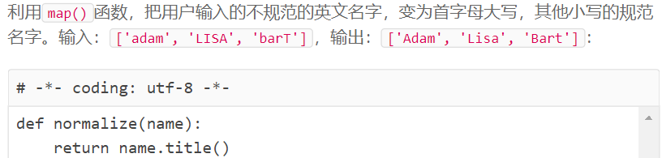
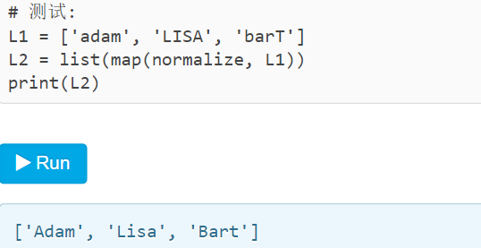
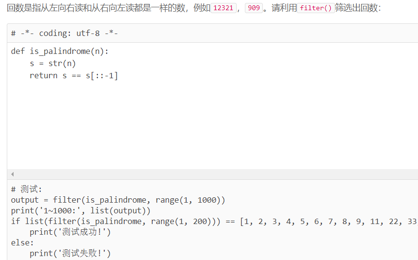

# Python学习2

## 高级特性

###切片

取一个list或tuple的部分元素是非常常见的操作。比如，一个list如下：

```
>>> L = ['Michael', 'Sarah', 'Tracy', 'Bob', 'Jack']
```

取前3个元素，应该怎么做？

笨办法：

```
>>> [L[0], L[1], L[2]]
['Michael', 'Sarah', 'Tracy']
```

之所以是笨办法是因为扩展一下，取前N个元素就没辙了。

取前N个元素，也就是索引为0-(N-1)的元素，可以用循环：

```
>>> r = []
>>> n = 3
>>> for i in range(n):
...     r.append(L[i])
... 
>>> r
['Michael', 'Sarah', 'Tracy']
```

对这种经常取指定索引范围的操作，用循环十分繁琐，因此，Python提供了切片（Slice）操作符，能大大简化这种操作。

对应上面的问题，取前3个元素，用一行代码就可以完成切片：

```
>>> L[0:3]
['Michael', 'Sarah', 'Tracy']
```

`L[0:3]`表示，从索引`0`开始取，直到索引`3`为止，但不包括索引`3`。即索引`0`，`1`，`2`，正好是3个元素。

如果第一个索引是`0`，还可以省略：

```
>>> L[:3]
['Michael', 'Sarah', 'Tracy']
```

也可以从索引1开始，取出2个元素出来：

```
>>> L[1:3]
['Sarah', 'Tracy']
```

类似的，既然Python支持`L[-1]`取倒数第一个元素，那么它同样支持倒数切片，试试：

```markdown
>>> L[-2:]
['Bob', 'Jack']
>>> L[-2:-1]
['Bob']
```

记住倒数第一个元素的索引是`-1`。

切片操作十分有用。我们先创建一个0-99的数列：

```
>>> L = list(range(100))
>>> L
[0, 1, 2, 3, ..., 99]
```

可以通过切片轻松取出某一段数列。比如前10个数：

```markdown
>>> L[:10]
[0, 1, 2, 3, 4, 5, 6, 7, 8, 9]
```

后10个数：

```
>>> L[-10:]
[90, 91, 92, 93, 94, 95, 96, 97, 98, 99]
```

前11-20个数：

```
>>> L[10:20]
[10, 11, 12, 13, 14, 15, 16, 17, 18, 19]
```

前10个数，每两个取一个：

```
>>> L[:10:2]
[0, 2, 4, 6, 8]
```

所有数，每5个取一个：

```
>>> L[::5]
[0, 5, 10, 15, 20, 25, 30, 35, 40, 45, 50, 55, 60, 65, 70, 75, 80, 85, 90, 95]
```

甚至什么都不写，只写`[:]`就可以原样复制一个list：

```
>>> L[:]
[0, 1, 2, 3, ..., 99]
```

tuple也是一种list，唯一区别是tuple不可变。因此，tuple也可以用切片操作，只是操作的结果仍是tuple：

```markdown
>>> (0, 1, 2, 3, 4, 5)[:3]
(0, 1, 2)
```

字符串`'xxx'`也可以看成是一种list，每个元素就是一个字符。因此，字符串也可以用切片操作，只是操作结果仍是字符串：

```
>>> 'ABCDEFG'[:3]
'ABC'
>>> 'ABCDEFG'[::2]
'ACEG'
```

在很多编程语言中，针对字符串提供了很多各种截取函数（例如，substring），其实目的就是对字符串切片。Python没有针对字符串的截取函数，只需要切片一个操作就可以完成，非常简单。

利用切片操作，实现一个trim()函数，去除字符串首尾的空格

```python
def trim(s):
    while len(s)>0 and s[0] == ' ':
        s = s[1:]
    while len(s)>0 and s[-1] == ' ':
        s = s[:-1]
    return s
```


### 迭代

如果给定一个`list`或`tuple`，我们可以通过`for`循环来遍历这个`list`或`tuple`，这种遍历我们称为迭代（Iteration）。

在Python中，迭代是通过`for ... in`来完成的，而很多语言比如C语言，迭代`list`是通过下标完成的，比如C代码：

```
for (i=0; i<length; i++) {
    n = list[i];
}
```

可以看出，Python的`for`循环抽象程度要高于C的`for`循环，因为Python的`for`循环不仅可以用在`list`或`tuple`上，还可以作用在其他可迭代对象上。

`list`这种数据类型虽然有下标，但很多其他数据类型是没有下标的，但是，只要是可迭代对象，无论有无下标，都可以迭代，比如`dict`就可以迭代：

```markdown
>>> d = {'a': 1, 'b': 2, 'c': 3}
>>> for key in d:
...     print(key)
...
a
c
b
```

因为`dict`的存储不是按照`list`的方式顺序排列，所以，迭代出的结果顺序很可能不一样。

默认情况下，`dict`迭代的是key。如果要迭代value，可以用`for value in d.values()`，如果要同时迭代key和value，可以用`for k, v in d.items()`。

由于字符串也是可迭代对象，因此，也可以作用于`for`循环：

```
>>> for ch in 'ABC':
...     print(ch)
...
A
B
C
```

所以，当我们使用`for`循环时，只要作用于一个可迭代对象，`for`循环就可以正常运行，而我们不太关心该对象究竟是`list`还是其他数据类型。

那么，如何判断一个对象是可迭代对象呢？方法是通过`collections.abc`模块的`Iterable`类型判断：

```markdown
>>> from collections.abc import Iterable
>>> isinstance('abc', Iterable) # str是否可迭代
True
>>> isinstance([1,2,3], Iterable) # list是否可迭代
True
>>> isinstance(123, Iterable) # 整数是否可迭代
False
```

最后一个小问题，如果要对`list`实现类似Java那样的下标循环怎么办？Python内置的`enumerate`函数可以把一个`list`变成索引-元素对，这样就可以在`for`循环中同时迭代索引和元素本身：

```
>>> for i, value in enumerate(['A', 'B', 'C']):
...     print(i, value)
...
0 A
1 B
2 C
```

上面的`for`循环里，同时引用了两个变量，在Python里是很常见的，比如下面的代码：

上面的`for`循环里，同时引用了两个变量，在Python里是很常见的，比如下面的代码：

```markdown
>>> for x, y in [(1, 1), (2, 4), (3, 9)]:
...     print(x, y)
...
1 1
2 4
3 9
```

请使用迭代查找一个list中最小和最大值，并返回一个tuple：

```python
def findMinAndMax(L):
    if len(L) == 0:
        return (None, None)
    else:
        min = max = L[0]
        for i in L[1:]:
            if min > i:
                min = i
            if max < i:
                max = i
        return (min, max)
```


### 列表生成式

列表生成式即List Comprehensions，是Python内置的非常简单却强大的可以用来创建list的生成式。

举个例子，要生成list `[1, 2, 3, 4, 5, 6, 7, 8, 9, 10]`可以用`list(range(1, 11))`：

```markdown
>>> list(range(1, 11))
[1, 2, 3, 4, 5, 6, 7, 8, 9, 10]
```

但如果要生成`[1x1, 2x2, 3x3, ..., 10x10]`怎么做？方法一是循环：

```markdown
>>> L = []
>>> for x in range(1, 11):
...    L.append(x * x)
...
>>> L
[1, 4, 9, 16, 25, 36, 49, 64, 81, 100]
```

但是循环太繁琐，而列表生成式则可以用一行语句代替循环生成上面的list：

```markdown
>>> [x * x for x in range(1, 11)]
[1, 4, 9, 16, 25, 36, 49, 64, 81, 100]
```

写列表生成式时，把要生成的元素`x * x`放到前面，后面跟`for`循环，就可以把list创建出来，十分有用，多写几次，很快就可以熟悉这种语法。

for循环后面还可以加上if判断，这样我们就可以筛选出仅偶数的平方：

```markdown
>>> [x * x for x in range(1, 11) if x % 2 == 0]
[4, 16, 36, 64, 100]
```

还可以使用两层循环，可以生成全排列：

```
>>> [m + n for m in 'ABC' for n in 'XYZ']
['AX', 'AY', 'AZ', 'BX', 'BY', 'BZ', 'CX', 'CY', 'CZ']
```

三层和三层以上的循环就很少用到了。

```markdown
>>> import os # 导入os模块，模块的概念后面讲到
>>> [d for d in os.listdir('.')] # os.listdir可以列出文件和目录
['.emacs.d', '.ssh', '.Trash', 'Adlm', 'Applications', 'Desktop', 'Documents', 'Downloads', 'Library', 'Movies', 'Music', 'Pictures', 'Public', 'VirtualBox VMs', 'Workspace', 'XCode']
```

`for`循环其实可以同时使用两个甚至多个变量，比如`dict`的`items()`可以同时迭代key和value：

```markdown
>>> d = {'x': 'A', 'y': 'B', 'z': 'C' }
>>> for k, v in d.items():
...     print(k, '=', v)
...
y = B
x = A
z = C
```

因此，列表生成式也可以使用两个变量来生成list：

```markdown
>>> d = {'x': 'A', 'y': 'B', 'z': 'C' }
>>> [k + '=' + v for k, v in d.items()]
['y=B', 'x=A', 'z=C']
```

最后把一个list中所有的字符串变成小写：

```markdown
>>> L = ['Hello', 'World', 'IBM', 'Apple']
>>> [s.lower() for s in L]
['hello', 'world', 'ibm', 'apple']
```


#### if...else

使用列表生成式的时候，有些童鞋经常搞不清楚`if...else`的用法。

例如，以下代码正常输出偶数：

```
>>> [x for x in range(1, 11) if x % 2 == 0]
[2, 4, 6, 8, 10]
```

但是，我们不能在最后的`if`加上`else`：

```
>>> [x for x in range(1, 11) if x % 2 == 0 else 0]
  File "<stdin>", line 1
    [x for x in range(1, 11) if x % 2 == 0 else 0]
                                              ^
SyntaxError: invalid syntax
```

这是因为`for`前面的部分是一个表达式，它必须根据`x`计算出一个结果。因此，考察表达式：`x if x % 2 == 0`，它无法根据`x`计算出结果，因为缺少`else`，必须加上`else`：

```
>>> [x if x % 2 == 0 else -x for x in range(1, 11)]
[-1, 2, -3, 4, -5, 6, -7, 8, -9, 10]
```

上述`for`前面的表达式`x if x % 2 == 0 else -x`才能根据`x`计算出确定的结果。

可见，在一个列表生成式中，`for`前面的`if ... else`是表达式，而`for`后面的`if`是过滤条件，不能带`else`。


#### 练习

如果list中既包含字符串，又包含整数，由于非字符串类型没有`lower()`方法，所以列表生成式会报错：

```
>>> L = ['Hello', 'World', 18, 'Apple', None]
>>> [s.lower() for s in L]
Traceback (most recent call last):
  File "<stdin>", line 1, in <module>
  File "<stdin>", line 1, in <listcomp>
AttributeError: 'int' object has no attribute 'lower'
```

使用内建的`isinstance`函数可以判断一个变量是不是字符串：

```markdown
>>> x = 'abc'
>>> y = 123
>>> isinstance(x, str)
True
>>> isinstance(y, str)
False
```



### 生成器


可以直接作用于for循环的数据类型有以下几种：

一类是集合数据类型，如list、tuple、dict、set、str等；

一类是generator，包括生成器和带yield的generator function。

这些可以直接作用于for循环的对象统称为可迭代对象：Iterable。

可以被next()函数调用并不断返回下一个值的对象称为迭代器：Iterator

> 凡是可作用于for循环的对象都是Iterable类型；
>
> 凡是可作用于next()函数的对象都是Iterator类型，它们表示一个惰性计算的序列；
>
> 集合数据类型如list、dict、str等是Iterable但不是Iterator，不过可以通过iter()函数获得一个Iterator对象。


通过列表生成式，我们可以直接创建一个列表。但是，受到内存限制，列表容量肯定是有限的。而且，创建一个包含100万个元素的列表，不仅占用很大的存储空间，如果我们仅仅需要访问前面几个元素，那后面绝大多数元素占用的空间都白白浪费了。

所以，如果列表元素可以按照某种算法推算出来，那我们是否可以在循环的过程中不断推算出后续的元素呢？这样就不必创建完整的list，从而节省大量的空间。在Python中，这种一边循环一边计算的机制，称为生成器：generator。

要创建一个generator，有很多种方法。第一种方法很简单，只要把一个列表生成式的`[]`改成`()`，就创建了一个generator：

```markdown
>>> L = [x * x for x in range(10)]
>>> L
[0, 1, 4, 9, 16, 25, 36, 49, 64, 81]
>>> g = (x * x for x in range(10))
>>> g
<generator object <genexpr> at 0x1022ef630>
```

创建`L`和`g`的区别仅在于最外层的`[]`和`()`，`L`是一个list，而`g`是一个generator。

我们可以直接打印出list的每一个元素，但我们怎么打印出generator的每一个元素呢？


如果要一个一个打印出来，可以通过`next()`函数获得generator的下一个返回值：

```markdown
>>> next(g)
0
>>> next(g)
1
>>> next(g)
4
>>> next(g)
9
>>> next(g)
16
>>> next(g)
25
>>> next(g)
36
>>> next(g)
49
>>> next(g)
64
>>> next(g)
81
>>> next(g)
Traceback (most recent call last):
  File "<stdin>", line 1, in <module>
StopIteration
```

我们讲过，generator保存的是算法，每次调用`next(g)`，就计算出`g`的下一个元素的值，直到计算到最后一个元素，没有更多的元素时，抛出`StopIteration`的错误。



当然，上面这种不断调用`next(g)`实在是太变态了，正确的方法是使用`for`循环，因为generator也是可迭代对象：

```markdown
>>> g = (x * x for x in range(10))
>>> for n in g:
...     print(n)
... 
0
1
4
9
16
25
36
49
64
81
```

所以，我们创建了一个generator后，基本上永远不会调用`next()`，而是通过`for`循环来迭代它，并且不需要关心`StopIteration`的错误。

generator非常强大。如果推算的算法比较复杂，用类似列表生成式的`for`循环无法实现的时候，还可以用函数来实现。

比如，著名的斐波拉契数列（Fibonacci），除第一个和第二个数外，任意一个数都可由前两个数相加得到：

1, 1, 2, 3, 5, 8, 13, 21, 34, ...

斐波拉契数列用列表生成式写不出来，但是，用函数把它打印出来却很容易：

```markdown
def fib(max):
    n, a, b = 0, 0, 1
    while n < max:
        print(b)
        a, b = b, a + b
        n = n + 1
    return 'done'
```

*注意*，赋值语句：

```
a, b = b, a + b
```

相当于：

```markdown
t = (b, a + b) # t是一个tuple
a = t[0]
b = t[1]
```

但不必显式写出临时变量t就可以赋值。

上面的函数可以输出斐波那契数列的前N个数：

```markdown
>>> fib(6)
1
1
2
3
5
8
'done'
```

仔细观察，可以看出，`fib`函数实际上是定义了斐波拉契数列的推算规则，可以从第一个元素开始，推算出后续任意的元素，这种逻辑其实非常类似generator。

也就是说，上面的函数和generator仅一步之遥。要把`fib`函数变成generator，只需要把`print(b)`改为`yield b`就可以了：

```markdown
def fib(max):
    n, a, b = 0, 0, 1
    while n < max:
        yield b
        a, b = b, a + b
        n = n + 1
    return 'done'
```

这就是定义generator的另一种方法。如果一个函数定义中包含`yield`关键字，那么这个函数就不再是一个普通函数，而是一个generator：

```markdown
>>> f = fib(6)
>>> f
<generator object fib at 0x104feaaa0>
```

给fib传入的参数决定了迭代器的结束条件

这里，最难理解的就是generator和函数的执行流程不一样。函数是顺序执行，遇到`return`语句或者最后一行函数语句就返回。而变成generator的函数，在每次调用`next()`的时候执行，遇到`yield`语句返回，再次执行时从上次返回的`yield`语句处继续执行。

举个简单的例子，定义一个generator，依次返回数字1，3，5：

```python
def odd():
    print('step 1')
    yield 1
    print('step 2')
    yield(3)
    print('step 3')
    yield(5)
```

调用该generator时，首先要生成一个generator对象，然后用`next()`函数不断获得下一个返回值：

```markdown
>>> o = odd()
>>> next(o)
step 1
1
>>> next(o)
step 2
3
>>> next(o)
step 3
5
>>> next(o)
Traceback (most recent call last):
  File "<stdin>", line 1, in <module>
StopIteration
```

可以看到，`odd`不是普通函数，而是generator，在执行过程中，遇到`yield`就中断，下次又继续执行。执行3次`yield`后，已经没有`yield`可以执行了，所以，第4次调用`next(o)`就报错。

回到`fib`的例子，我们在循环过程中不断调用`yield`，就会不断中断。当然要给循环设置一个条件来退出循环，不然就会产生一个无限数列出来。

同样的，把函数改成generator后，我们基本上从来不会用`next()`来获取下一个返回值，而是直接使用`for`循环来迭代：

```markdown
>>> for n in fib(6):
...     print(n)
...
1
1
2
3
5
8
```

但是用`for`循环调用generator时，发现拿不到generator的`return`语句的返回值。如果想要拿到返回值，必须捕获`StopIteration`错误，返回值包含在`StopIteration`的`value`中：

```markdown
>>> g = fib(6)
>>> while True:
...     try:
...         x = next(g)
...         print('g:', x)
...     except StopIteration as e:
...         print('Generator return value:', e.value)
...         break
...
g: 1
g: 1
g: 2
g: 3
g: 5
g: 8
Generator return value: done
```




#### 练习





```python
def triangles():
    N=[1]
    while True:
        yield N
        S = N
        S.append(0)
        N = [S[i-1]+S[i] for i in range(len(S))]
        
n = 0
results = []
for t in triangles():
    print(t)
    results.append(t)
    n = n + 1
    if n == 10:
        break
if results == [
    [1],
    [1, 1],
    [1, 2, 1],
    [1, 3, 3, 1],
    [1, 4, 6, 4, 1],
    [1, 5, 10, 10, 5, 1],
    [1, 6, 15, 20, 15, 6, 1],
    [1, 7, 21, 35, 35, 21, 7, 1],
    [1, 8, 28, 56, 70, 56, 28, 8, 1],
    [1, 9, 36, 84, 126, 126, 84, 36, 9, 1]
]:
    print('测试通过!')
else:
    print('测试失败!')
```


### 迭代器

我们已经知道，可以直接作用于`for`循环的数据类型有以下几种：

一类是集合数据类型，如`list`、`tuple`、`dict`、`set`、`str`等；

一类是`generator`，包括生成器和带`yield`的generator function。

这些可以直接作用于`for`循环的对象统称为可迭代对象：`Iterable`。

可以使用`isinstance()`判断一个对象是否是`Iterable`对象：

```markdown
>>> from collections.abc import Iterable
>>> isinstance([], Iterable)
True
>>> isinstance({}, Iterable)
True
>>> isinstance('abc', Iterable)
True
>>> isinstance((x for x in range(10)), Iterable)
True
>>> isinstance(100, Iterable)
False
```

而生成器不但可以作用于`for`循环，还可以被`next()`函数不断调用并返回下一个值，直到最后抛出`StopIteration`错误表示无法继续返回下一个值了。

可以被`next()`函数调用并不断返回下一个值的对象称为迭代器：`Iterator`。

可以使用`isinstance()`判断一个对象是否是`Iterator`对象：

```markdown
>>> from collections.abc import Iterator
>>> isinstance((x for x in range(10)), Iterator)
True
>>> isinstance([], Iterator)
False
>>> isinstance({}, Iterator)
False
>>> isinstance('abc', Iterator)
False
```

生成器都是`Iterator`对象，但`list`、`dict`、`str`虽然是`Iterable`，却不是`Iterator`。

把`list`、`dict`、`str`等`Iterable`变成`Iterator`可以使用`iter()`函数：

```markdown
>>> isinstance(iter([]), Iterator)
True
>>> isinstance(iter('abc'), Iterator)
True
```

你可能会问，为什么`list`、`dict`、`str`等数据类型不是`Iterator`？

这是因为Python的`Iterator`对象表示的是一个数据流，Iterator对象可以被`next()`函数调用并不断返回下一个数据，直到没有数据时抛出`StopIteration`错误。可以把这个数据流看做是一个有序序列，但我们却不能提前知道序列的长度，只能不断通过`next()`函数实现按需计算下一个数据，所以`Iterator`的计算是惰性的，只有在需要返回下一个数据时它才会计算。

`Iterator`甚至可以表示一个无限大的数据流，例如全体自然数。而使用list是永远不可能存储全体自然数的。

Python的`for`循环本质上就是通过不断调用`next()`函数实现的，例如：

```
for x in [1, 2, 3, 4, 5]:
    pass
```

实际上完全等价于：

```
# 首先获得Iterator对象:
it = iter([1, 2, 3, 4, 5])
# 循环:
while True:
    try:
        # 获得下一个值:
        x = next(it)
    except StopIteration:
        # 遇到StopIteration就退出循环
        break
```


## 函数式编程

函数是Python内建支持的一种封装，我们通过把大段代码拆成函数，通过一层一层的函数调用，就可以把复杂任务分解成简单的任务，这种分解可以称之为面向过程的程序设计。函数就是面向过程的程序设计的基本单元。

而函数式编程（请注意多了一个“式”字）——Functional Programming，虽然也可以归结到面向过程的程序设计，但其思想更接近数学计算。

我们首先要搞明白计算机（Computer）和计算（Compute）的概念。

在计算机的层次上，CPU执行的是加减乘除的指令代码，以及各种条件判断和跳转指令，所以，汇编语言是最贴近计算机的语言。

而计算则指数学意义上的计算，越是抽象的计算，离计算机硬件越远。

函数式编程就是一种抽象程度很高的编程范式，纯粹的函数式编程语言编写的函数没有变量，因此，任意一个函数，只要输入是确定的，输出就是确定的，这种纯函数我们称之为没有副作用。而允许使用变量的程序设计语言，由于函数内部的变量状态不确定，同样的输入，可能得到不同的输出，因此，这种函数是有副作用的。

函数式编程的一个特点就是，允许把函数本身作为参数传入另一个函数，还允许返回一个函数！

Python对函数式编程提供部分支持。由于Python允许使用变量，因此，Python不是纯函数式编程语言。


### 高阶函数

高阶函数英文叫Higher-order function。什么是高阶函数？我们以实际代码为例子，一步一步深入概念。

##### 变量可以指向函数

以Python内置的求绝对值的函数`abs()`为例，调用该函数用以下代码：

```
>>> abs(-10)
10
```

但是，如果只写`abs`呢？

```
>>> abs
<built-in function abs>
```

可见，`abs(-10)`是函数调用，而`abs`是函数本身。

要获得函数调用结果，我们可以把结果赋值给变量：

```markdown
>>> x = abs(-10)
>>> x
10
```

但是，如果把函数本身赋值给变量呢？

```
>>> f = abs
>>> f
<built-in function abs>
```

结论：函数本身也可以赋值给变量，即：变量可以指向函数。

如果一个变量指向了一个函数，那么，可否通过该变量来调用这个函数？用代码验证一下：

```
>>> f = abs
>>> f(-10)
10
```

成功！说明变量`f`现在已经指向了`abs`函数本身。直接调用`abs()`函数和调用变量`f()`完全相同。

##### 函数名也是变量

那么函数名是什么呢？函数名其实就是指向函数的变量！对于`abs()`这个函数，完全可以把函数名`abs`看成变量，它指向一个可以计算绝对值的函数！

如果把`abs`指向其他对象，会有什么情况发生？

```
>>> abs = 10
>>> abs(-10)
Traceback (most recent call last):
  File "<stdin>", line 1, in <module>
TypeError: 'int' object is not callable
```

把`abs`指向`10`后，就无法通过`abs(-10)`调用该函数了！因为`abs`这个变量已经不指向求绝对值函数而是指向一个整数`10`！

当然实际代码绝对不能这么写，这里是为了说明函数名也是变量。要恢复`abs`函数，请重启Python交互环境。

注：由于`abs`函数实际上是定义在`import builtins`模块中的，所以要让修改`abs`变量的指向在其它模块也生效，要用`import builtins; builtins.abs = 10`。


##### 传入函数

既然变量可以指向函数，函数的参数能接收变量，那么一个函数就可以接收另一个函数作为参数，这种函数就称之为高阶函数。

一个最简单的高阶函数：

```
def add(x, y, f):
    return f(x) + f(y)
```

当我们调用`add(-5, 6, abs)`时，参数`x`，`y`和`f`分别接收`-5`，`6`和`abs`，根据函数定义，我们可以推导计算过程为：

```markdown
x = -5
y = 6
f = abs
f(x) + f(y) ==> abs(-5) + abs(6) ==> 11
return 11
```

编写高阶函数，就是让函数的参数能够接收别的函数


#### map/reduce

Python内建了`map()`和`reduce()`函数。

我们先看map。`map()`函数接收两个参数，一个是函数，一个是`Iterable`，`map`将传入的函数依次作用到序列的每个元素，并把结果作为新的`Iterator`返回。

举例说明，比如我们有一个函数f(x)=x2，要把这个函数作用在一个list `[1, 2, 3, 4, 5, 6, 7, 8, 9]`上，就可以用`map()`实现如下：



现在，我们用Python代码实现：

```markdown
>>> def f(x):
...     return x * x
...
>>> r = map(f, [1, 2, 3, 4, 5, 6, 7, 8, 9])
>>> list(r)
[1, 4, 9, 16, 25, 36, 49, 64, 81]
```

`map()`传入的第一个参数是`f`，即函数对象本身。由于结果`r`是一个`Iterator`，`Iterator`是惰性序列，因此通过`list()`函数让它把整个序列都计算出来并返回一个list。

，`map()`作为高阶函数，事实上它把运算规则抽象了，因此，我们不但可以计算简单的f(x)=x2，还可以计算任意复杂的函数，比如，把这个list所有数字转为字符串：

```
>>> list(map(str, [1, 2, 3, 4, 5, 6, 7, 8, 9]))
['1', '2', '3', '4', '5', '6', '7', '8', '9']
```

只需要一行代码。

再看`reduce`的用法。`reduce`把一个函数作用在一个序列`[x1, x2, x3, ...]`上，这个函数必须接收两个参数，`reduce`把结果继续和序列的下一个元素做累积计算，其效果就是：

```
reduce(f, [x1, x2, x3, x4]) = f(f(f(x1, x2), x3), x4)
```

比方说对一个序列求和，就可以用`reduce`实现：

```markdown
>>> from functools import reduce
>>> def add(x, y):
...     return x + y
...
>>> reduce(add, [1, 3, 5, 7, 9])
25
```

当然求和运算可以直接用Python内建函数`sum()`，没必要动用`reduce`。

但是如果要把序列`[1, 3, 5, 7, 9]`变换成整数`13579`，`reduce`就可以派上用场：

```markdown
>>> from functools import reduce
>>> def fn(x, y):
...     return x * 10 + y
...
>>> reduce(fn, [1, 3, 5, 7, 9])
13579
```

这个例子本身没多大用处，但是，如果考虑到字符串`str`也是一个序列，对上面的例子稍加改动，配合`map()`，我们就可以写出把`str`转换为`int`的函数：

```markdown
>>> from functools import reduce
>>> def fn(x, y):
...     return x * 10 + y
...
>>> def char2num(s):
...     digits = {'0': 0, '1': 1, '2': 2, '3': 3, '4': 4, '5': 5, '6': 6, '7': 7, '8': 8, '9': 9}
...     return digits[s]
...
>>> reduce(fn, map(char2num, '13579'))
13579
```

上述的亦可以改为

```python
reduce(fn, list(map(char2num, "13579")))
```

可以看出reduce的第二个参数是可迭代对象均可

整理成一个`str2int`的函数就是：

```markdown
from functools import reduce

DIGITS = {'0': 0, '1': 1, '2': 2, '3': 3, '4': 4, '5': 5, '6': 6, '7': 7, '8': 8, '9': 9}

def str2int(s):
    def fn(x, y):
        return x * 10 + y
    def char2num(s):
        return DIGITS[s]
    return reduce(fn, map(char2num, s))
```

还可以用lambda函数进一步简化成：

```
from functools import reduce

DIGITS = {'0': 0, '1': 1, '2': 2, '3': 3, '4': 4, '5': 5, '6': 6, '7': 7, '8': 8, '9': 9}

def char2num(s):
    return DIGITS[s]

def str2int(s):
    return reduce(lambda x, y: x * 10 + y, map(char2num, s))
```

也就是说，假设Python没有提供`int()`函数，你完全可以自己写一个把字符串转化为整数的函数，而且只需要几行代码！

##### 练习






#### filter

Python内建的`filter()`函数用于过滤序列。

和`map()`类似，`filter()`也接收一个函数和一个序列（可以是列表，range，迭代器）。和`map()`不同的是，`filter()`把传入的函数依次作用于每个元素，然后根据返回值是`True`还是`False`决定保留还是丢弃该元素。

例如，在一个list中，删掉偶数，只保留奇数，可以这么写：

```python
def is_odd(n):
    return n % 2 == 1

list(filter(is_odd, [1, 2, 4, 5, 6, 9, 10, 15]))
# 结果: [1, 5, 9, 15]
```


```python
print(list(filter(lambda x:x%2, range(10))))
```


filter返回的也是一个迭代器

```python
print(isinstance(filter(is_odd, L), Iterator))
```

把一个序列中的空字符串删掉，可以这么写：

```
def not_empty(s):
    return s and s.strip()

list(filter(not_empty, ['A', '', 'B', None, 'C', '  ']))
# 结果: ['A', 'B', 'C']
```

可见用`filter()`这个高阶函数，关键在于正确实现一个“筛选”函数。

注意到`filter()`函数返回的是一个`Iterator`，也就是一个惰性序列，所以要强迫`filter()`完成计算结果，需要用`list()`函数获得所有结果并返回list。


##### 用filter求素数

计算[素数](http://baike.baidu.com/view/10626.htm)的一个方法是[埃氏筛法](http://baike.baidu.com/view/3784258.htm)，它的算法理解起来非常简单：

首先，列出从`2`开始的所有自然数，构造一个序列：

2, 3, 4, 5, 6, 7, 8, 9, 10, 11, 12, 13, 14, 15, 16, 17, 18, 19, 20, ...

取序列的第一个数`2`，它一定是素数，然后用`2`把序列的`2`的倍数筛掉：

3, ~~4~~, 5, ~~6~~, 7, ~~8~~, 9, ~~10~~, 11, ~~12~~, 13, ~~14~~, 15, ~~16~~, 17, ~~18~~, 19, ~~20~~, ...

取新序列的第一个数`3`，它一定是素数，然后用`3`把序列的`3`的倍数筛掉：

5, ~~6~~, 7, ~~8~~, ~~9~~, ~~10~~, 11, ~~12~~, 13, ~~14~~, ~~15~~, ~~16~~, 17, ~~18~~, 19, ~~20~~, ...

取新序列的第一个数`5`，然后用`5`把序列的`5`的倍数筛掉：

7, ~~8~~, ~~9~~, ~~10~~, 11, ~~12~~, 13, ~~14~~, ~~15~~, ~~16~~, 17, ~~18~~, 19, ~~20~~, ...

不断筛下去，就可以得到所有的素数。

用Python来实现这个算法，可以先构造一个从`3`开始的奇数序列：

```python
def _odd_iter():
    n = 1
    while True:
        n = n + 2
        yield n
```

注意这是一个生成器，并且是一个无限序列。

然后定义一个筛选函数：

```python
def _not_divisible(n):
    return lambda x: x % n > 0
```

该函数返回一个函数，筛掉n的倍数

最后，定义一个生成器，不断返回下一个素数：

```
def primes():
    yield 2
    it = _odd_iter() # 初始序列
    while True:
        n = next(it) # 返回序列的第一个数
        yield n
        it = filter(_not_divisible(n), it) # 构造新序列
```

这个生成器先返回第一个素数`2`，然后，利用`filter()`不断产生筛选后的新的序列。

由于`primes()`也是一个无限序列，所以调用时需要设置一个退出循环的条件：

```
# 打印1000以内的素数:
for n in primes():
    if n < 1000:
        print(n)
    else:
        break
```

注意到`Iterator`是惰性计算的序列，所以我们可以用Python表示“全体自然数”，“全体素数”这样的序列，而代码非常简洁。

#####练习




#### sorted

排序也是在程序中经常用到的算法。无论使用冒泡排序还是快速排序，排序的核心是比较两个元素的大小。如果是数字，我们可以直接比较，但如果是字符串或者两个dict呢？直接比较数学上的大小是没有意义的，因此，比较的过程必须通过函数抽象出来。

Python内置的`sorted()`函数就可以对list进行排序：

```markdown
>>> sorted([36, 5, -12, 9, -21])
[-21, -12, 5, 9, 36]
```

此外，`sorted()`函数也是一个高阶函数，它还可以接收一个`key`函数来实现自定义的排序，例如按绝对值大小排序：

```
>>> sorted([36, 5, -12, 9, -21], key=abs)
[5, 9, -12, -21, 36]
```

**key指定的函数将作用于list的每一个元素上，并根据key函数返回的结果进行排序**。对比原始的list和经过`key=abs`处理过的list：

```python
list = [36, 5, -12, 9, -21]

keys = [36, 5,  12, 9,  21]
```

然后`sorted()`函数按照keys进行排序，并按照对应关系返回list相应的元素：

```ascii
keys排序结果 => [5, 9,  12,  21, 36]
                |  |    |    |   |
最终结果     => [5, 9, -12, -21, 36]
```

我们再看一个字符串排序的例子：

```
>>> sorted(['bob', 'about', 'Zoo', 'Credit'])
['Credit', 'Zoo', 'about', 'bob']
```

默认情况下，对字符串排序，是按照ASCII的大小比较的，由于`'Z' < 'a'`，结果，大写字母`Z`会排在小写字母`a`的前面。

现在，我们提出排序应该忽略大小写，按照字母序排序。要实现这个算法，不必对现有代码大加改动，只要我们能用一个key函数把字符串映射为忽略大小写排序即可。忽略大小写来比较两个字符串，实际上就是先把字符串都变成大写（或者都变成小写），再比较。

这样，我们给`sorted`传入key函数，即可实现忽略大小写的排序：

```markdown
>>> sorted(['bob', 'about', 'Zoo', 'Credit'], key=str.lower)
['about', 'bob', 'Credit', 'Zoo']
```

要进行反向排序，不必改动key函数，可以传入第三个参数`reverse=True`：

```
>>> sorted(['bob', 'about', 'Zoo', 'Credit'], key=str.lower, reverse=True)
['Zoo', 'Credit', 'bob', 'about']
```

从上述例子可以看出，高阶函数的抽象能力是非常强大的，而且，核心代码可以保持得非常简洁。

##### 练习

假设我们用一组tuple表示学生名字和成绩：

```markdown
L = [('Bob', 75), ('Adam', 92), ('Bart', 66), ('Lisa', 88)]
```

```python
#请用sorted()对上述列表按名字排序
def by_name(t):
    return t[0]


L = [('Bob', 75), ('Adam', 92), ('Bart', 66), ('Lisa', 88)]
print(sorted(L, key=by_name))
print(L)   #L不变

##请用sorted()对上述列表按分数排序
def by_score(t):
    return t[1]


print(sorted(L, key=by_score))  #L不变
print(L)
```

### 返回函数

高阶函数除了可以接受函数作为参数外，还可以把函数作为结果值返回。

我们来实现一个可变参数的求和。通常情况下，求和的函数是这样定义的：

```python
def calc_sum(*args):
    ax = 0
    for n in args:
        ax = ax + n
    return ax
```

但是，如果不需要立刻求和，而是在后面的代码中，根据需要再计算怎么办？（产生延迟效应）可以不返回求和的结果，而是返回求和的函数：

```python
def lazy_sum(*args):
    def sum():
        ax = 0
        for n in args:
            ax = ax + n
        return ax
    return sum
```

当我们调用`lazy_sum()`时，返回的并不是求和结果，而是求和函数：

```
>>> f = lazy_sum(1, 3, 5, 7, 9)
>>> f
<function lazy_sum.<locals>.sum at 0x101c6ed90>
```

调用函数`f`时，才真正计算求和的结果：

```markdown
>>> f()
25
```

在这个例子中，我们在函数`lazy_sum`中又定义了函数`sum`，并且，**内部函数`sum`可以引用外部函数`lazy_sum`的参数和局部变量，当`lazy_sum`返回函数`sum`时，相关参数和变量都保存在返回的函数中**，这种称为“闭包（Closure）”的程序结构拥有极大的威力。

请再注意一点，当我们调用`lazy_sum()`时，每次调用都会返回一个新的函数，即使传入相同的参数：

```
>>> f1 = lazy_sum(1, 3, 5, 7, 9)
>>> f2 = lazy_sum(1, 3, 5, 7, 9)
>>> f1==f2
False
```

`f1()`和`f2()`的调用结果互不影响。

#### 闭包

注意到返回的函数在其定义内部引用了局部变量`args`，所以，当一个函数返回了一个函数后，其内部的局部变量还被新函数引用，所以，闭包用起来简单，实现起来可不容易。

另一个需要注意的问题是，返回的函数并没有立刻执行，而是直到调用了`f()`才执行。我们来看一个例子：

```
def count():
    fs = []
    for i in range(1, 4):
        def f():
             return i*i
        fs.append(f)
    return fs

f1, f2, f3 = count()
```

在上面的例子中，每次循环，都创建了一个新的函数，然后，把创建的3个函数都返回了。

你可能认为调用`f1()`，`f2()`和`f3()`结果应该是`1`，`4`，`9`，但实际结果是：

```markdown
>>> f1()
9
>>> f2()
9
>>> f3()
9
```

全部都是`9`！原因就在于返回的函数引用了变量`i`，但它并非立刻执行。等到3个函数都返回时，它们所引用的变量`i`已经变成了`3`，因此最终结果为`9`。

 **返回闭包时牢记一点：返回函数不要引用任何循环变量，或者后续会发生变化的变量。**

如果一定要引用循环变量怎么办？方法是再创建一个函数，用该函数的参数绑定循环变量当前的值，无论该循环变量后续如何更改，已绑定到函数参数的值不变：

如果一定要引用循环变量怎么办？方法是再创建一个函数，用该函数的参数绑定循环变量当前的值，无论该循环变量后续如何更改，已绑定到函数参数的值不变：

```python
def count():
    def f(j):
        def g():
            return j*j
        return g
    fs = []
    for i in range(1, 4):
        fs.append(f(i)) # f(i)立刻被执行，因此i的当前值被传入f()
    return fs
```

再看看结果：

```markdown
>>> f1, f2, f3 = count()
>>> f1()
1
>>> f2()
4
>>> f3()
9
```

缺点是代码较长，可利用lambda函数缩短代码。

#### 练习

利用闭包返回一个计数器函数，每次调用它返回递增整数：

```python
def createCounter():
    s = 0

    def counter():
        nonlocal s #nonlocal关键字用于内部函数更改外层函数的外部变量的关键字
        s= s + 1
        return s

    return counter

# 测试:
counterA = createCounter()
print(counterA(), counterA(), counterA(), counterA(), counterA()) # 1 2 3 4 5
counterB = createCounter()
if [counterB(), counterB(), counterB(), counterB()] == [1, 2, 3, 4]:
    print('测试通过!')
else:
    print('测试失败!')
```


### 匿名函数

当我们在传入函数时，有些时候，不需要显式地定义函数，直接传入匿名函数更方便。

在Python中，对匿名函数提供了有限支持。还是以`map()`函数为例，计算f(x)=x2时，除了定义一个`f(x)`的函数外，还可以直接传入匿名函数：

```
>>> list(map(lambda x: x * x, [1, 2, 3, 4, 5, 6, 7, 8, 9]))
[1, 4, 9, 16, 25, 36, 49, 64, 81]
```

通过对比可以看出，匿名函数`lambda x: x * x`实际上就是：

```python
def f(x):
    return x * x
```

关键字`lambda`表示匿名函数，冒号前面的`x`表示函数参数。

匿名函数有个限制，就是只能有一个表达式，不用写`return`，返回值就是该表达式的结果。

用匿名函数有个好处，因为函数没有名字，不必担心函数名冲突。此外，匿名函数也是一个函数对象，也可以把匿名函数赋值给一个变量，再利用变量来调用该函数：

```python
>>> f = lambda x: x * x
>>> f
<function <lambda> at 0x101c6ef28>
>>> f(5)
25
```

同样，也可以把匿名函数作为返回值返回，比如：

```python
def build(x, y):
    return lambda: x * x + y * y
```


### 装饰器

由于函数也是一个对象，而且函数对象可以被赋值给变量，所以，通过变量也能调用该函数。

```markdown
>>> def now():
...     print('2015-3-25')
...
>>> f = now
>>> f()
2015-3-25
```

函数对象有一个`__name__`属性，可以拿到函数的名字：

```markdown
>>> now.__name__
'now'
>>> f.__name__
'now'
```

现在，假设我们要增强`now()`函数的功能，比如，在函数调用前后自动打印日志，但又不希望修改`now()`函数的定义，这种在代码运行期间动态增加功能的方式，称之为“装饰器”（Decorator）。

本质上，decorator就是一个返回函数的高阶函数。所以，我们要定义一个能打印日志的decorator，可以定义如下：

```python
def log(func):
    def wrapper(*args, **kw):
        print('call %s():' % func.__name__)
        return func(*args, **kw)
    return wrapper
```

观察上面的`log`，因为它是一个decorator，所以接受一个函数作为参数，并返回一个函数。我们要借助Python的@语法，把decorator置于函数的定义处：

```
@log
def now():
    print('2015-3-25')
```

调用`now()`函数，不仅会运行`now()`函数本身，还会在运行`now()`函数前打印一行日志：

```markdown
>>> now()
call now():
2015-3-25
```

把`@log`放到`now()`函数的定义处，相当于执行了语句：

```python
now = log(now)
```

由于`log()`是一个decorator，返回一个函数，所以，原来的`now()`函数仍然存在，只是现在同名的`now`变量指向了新的函数，于是调用`now()`将执行新函数，即在`log()`函数中返回的`wrapper()`函数。

`wrapper()`函数的参数定义是`(*args, **kw)`，因此，`wrapper()`函数可以接受任意参数的调用。在`wrapper()`函数内，首先打印日志，再紧接着调用原始函数。


**未修改前的代码**

```python
import time

#判断质数的函数
def is_prime(num):
    if num < 2:
        return False
    elif num == 2:
        return True
    else:
        for i in range(2, num):
            if num % i == 0:
                return False
        return True

def prime_nums():
    t1 = time.time()
    for i in range(2, 10000):
        if is_prime(i):
            print(i)
    t2 = time.time()
    print(t2 - t1) #输出运行时间
    

prime_nums()
```


**使用装饰器进行修改（函数无返回值）**

```python
import time

def display_time(func):   #装饰器也是一个高阶函数，其参数是被调用的函数
    def wrapper():      #在装饰器内定义一个函数，装饰器就是返回该函数
        t1 = time.time()
        func()  #在此处调用函数
        t2 = time.time()
        print(t2 - t1)
    return wrapper

#判断质数的函数
def is_prime(num):
    if num < 2:
        return False
    elif num == 2:
        return True
    else:
        for i in range(2, num):
            if num % i == 0:
                return False
        return True

@display_time
def prime_nums():
    for i in range(2, 10000):
        if is_prime(i):
            print(i)

prime_nums()
#运行prime_nums时，实质是运行display_time，再跳到wrapper内，运行其内的内容
```


**使用装饰器进行修改（函数有返回值）**

```python
import time

def display_time(func):
    def wrapper():
        t1 = time.time()
        result = func()  #使用一个变量记录函数的返回结果
        t2 = time.time()
        print("Total time: {:.4}".format(t2 - t1))
        return result   #返回函数调用的结果
    return wrapper

#判断质数的函数
def is_prime(num):
    if num < 2:
        return False
    elif num == 2:
        return True
    else:
        for i in range(2, num):
            if num % i == 0:
                return False
        return True

@display_time
def count_prime_nums():
    count = 0
    for i in range(2, 10000):
        if is_prime(i):
            count += 1
    return count

print(count_prime_nums())
```


**使用装饰器进行修改（函数有参数）**

```python
import time

def display_time(func):
    def wrapper(*args):  #在wrapper中使用可变参数
        t1 = time.time()
        result = func(*args)  #func的参数和wrapper的参数相同
        t2 = time.time()
        print("Total time: {:.4}".format(t2 - t1))
        return result   
    return wrapper

#判断质数的函数
def is_prime(num):
    if num < 2:
        return False
    elif num == 2:
        return True
    else:
        for i in range(2, num):
            if num % i == 0:
                return False
        return True

@display_time
def count_prime_nums(maxnum):
    count = 0
    for i in range(2, maxnum):
        if is_prime(i):
            count += 1
    return count

print(count_prime_nums(100))
```

