# python学习1


## 安装

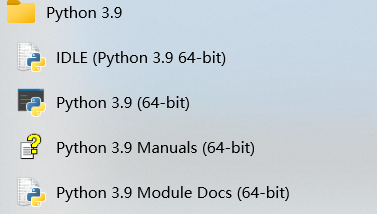

IDLE为python自带的简易的开发环境

Python3.9为交互式命令行程序

Manuals为官方技术文档

Module Docs为已安装的模块的文档

#### pycharm安装

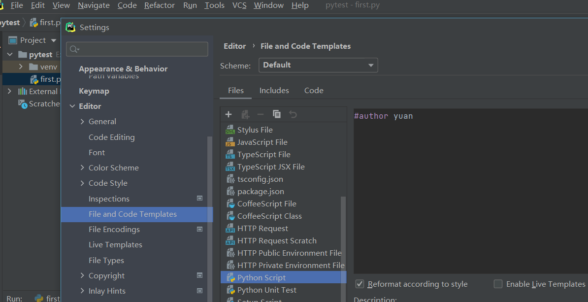

此处为设置.py文件的模板


####print

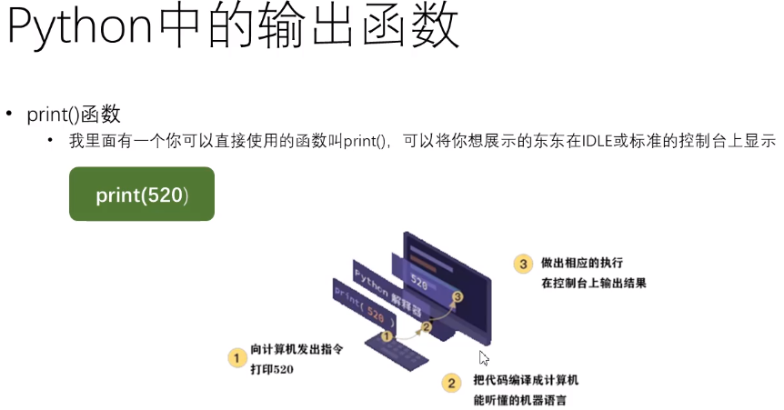

python解释器将代码编译成机器语言


### 输出

用`print()`在括号中加上字符串，就可以向屏幕上输出指定的文字。比如输出`'hello, world'`，用代码实现如下：

```python
print('hello, world')
```

`print()`函数也可以接受多个字符串，用逗号“,”隔开，就可以连成一串输出：

```python
print('The quick brown fox', 'jumps over', 'the lazy dog')

The quick brown fox jumps over the lazy dog
```

`print()`会依次打印每个字符串，遇到逗号“,”会输出一个空格，因此，输出的字符串是这样拼起来的：

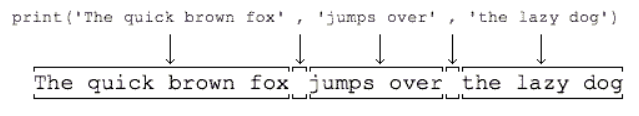

`print()`也可以打印整数，或者计算结果：

```python
>>> print(300)
300
>>> print(100 + 200)
300
```

因此，我们可以把计算`100 + 200`的结果打印得更漂亮一点：

```
>>> print('100 + 200 =', 100 + 200)
100 + 200 = 300
```

注意，对于`100 + 200`，Python解释器自动计算出结果`300`，但是，`'100 + 200 ='`是字符串而非数学公式，Python把它视为字符串。


使用`print(x, end='')`可使输出不换行，引号之间的内容就是结束的内容，可以是空格，也可以是其他字符，默认为换行


### 输入

现在，你已经可以用`print()`输出你想要的结果了。但是，如果要让用户从电脑输入一些字符怎么办？Python提供了一个`input()`，可以让用户输入字符串，并存放到一个变量里。比如输入用户的名字：

```python
>>> name = input()
Michael
```

当你输入`name = input()`并按下回车后，Python交互式命令行就在等待你的输入了。这时，你可以输入任意字符，然后按回车后完成输入。

输入完成后，不会有任何提示，Python交互式命令行又回到`>>>`状态了。那我们刚才输入的内容到哪去了？答案是存放到`name`变量里了。可以直接输入`name`查看变量内容：

```python
>>> name
'Michael'
```

要打印出`name`变量的内容，除了直接写`name`然后按回车外，还可以用`print()`函数：

```
>>> print(name)
Michael
```

有了输入和输出，我们就可以把上次打印`'hello, world'`的程序改成有点意义的程序了：

```
name = input()
print('hello,', name)
```

运行上面的程序，第一行代码会让用户输入任意字符作为自己的名字，然后存入`name`变量中；第二行代码会根据用户的名字向用户说`hello`，比如输入`Michael`：

```python
C:\Workspace> python hello.py
Michael
hello, Michael
```

`input()`可以让你显示一个字符串来提示用户，于是我们把代码改成：

```
name = input('please enter your name: ')
print('hello,', name)
```

再次运行这个程序，你会发现，程序一运行，会首先打印出`please enter your name:`，这样，用户就可以根据提示，输入名字后，得到`hello, xxx`的输出：

```python
C:\Workspace> python hello.py
please enter your name: Michael
hello, Michael
```

每次运行该程序，根据用户输入的不同，输出结果也会不同。

在命令行下，输入和输出就是这么简单。

## python基础


编译器或者解释器就是负责把符合语法的程序代码转换成CPU能够执行的机器码，然后执行。

Python的语法比较简单，采用缩进方式，写出来的代码就像下面的样子：

```markdown
# print absolute value of an integer:
a = 100
if a >= 0:
    print(a)
else:
    print(-a)
```

以`#`开头的语句是注释，注释是给人看的，可以是任意内容，解释器会忽略掉注释。其他每一行都是一个语句，当语句以冒号`:`结尾时，缩进的语句视为代码块。

缩进有利有弊。好处是强迫你写出格式化的代码，但没有规定缩进是几个空格还是Tab。按照约定俗成的惯例，应该始终坚持使用*4个空格*的缩进。

缩进的另一个好处是强迫你写出缩进较少的代码，你会倾向于把一段很长的代码拆分成若干函数，从而得到缩进较少的代码。

缩进的坏处就是“复制－粘贴”功能失效了，这是最坑爹的地方。当你重构代码时，粘贴过去的代码必须重新检查缩进是否正确。此外，IDE很难像格式化Java代码那样格式化Python代码。

最后，请务必注意，Python程序是大小写敏感的，如果写错了大小写，程序会报错。


### 数据类型和变量

####数据类型

计算机顾名思义就是可以做数学计算的机器，因此，计算机程序理所当然地可以处理各种数值。但是，计算机能处理的远不止数值，还可以处理文本、图形、音频、视频、网页等各种各样的数据，不同的数据，需要定义不同的数据类型。在Python中，能够直接处理的数据类型有以下几种：

####整数

Python可以处理任意大小的整数，当然包括负整数，在程序中的表示方法和数学上的写法一模一样，例如：`1`，`100`，`-8080`，`0`，等等。

计算机由于使用二进制，所以，有时候用十六进制表示整数比较方便，十六进制用`0x`前缀和0-9，a-f表示，例如：`0xff00`，`0xa5b4c3d2`，等等。

对于很大的数，例如`10000000000`，很难数清楚0的个数。Python允许在数字中间以`_`分隔，因此，写成`10_000_000_000`和`10000000000`是完全一样的。十六进制数也可以写成`0xa1b2_c3d4`。


#### 浮点数

浮点数也就是小数，之所以称为浮点数，是因为按照科学记数法表示时，一个浮点数的小数点位置是可变的，比如，1.23x109和12.3x108是完全相等的。浮点数可以用数学写法，如`1.23`，`3.14`，`-9.01`，等等。但是对于很大或很小的浮点数，就必须用科学计数法表示，把10用e替代，1.23x109就是`1.23e9`，或者`12.3e8`，0.000012可以写成`1.2e-5`，等等。

整数和浮点数在计算机内部存储的方式是不同的，整数运算永远是精确的（除法难道也是精确的？是的！），而浮点数运算则可能会有四舍五入的误差。


##### 数的大小问题

注意：Python的整数没有大小限制，而某些语言的整数根据其存储长度是有大小限制的，例如Java对32位整数的范围限制在`-2147483648`-`2147483647`。

Python的浮点数也没有大小限制，但是超出一定范围就直接表示为`inf`（无限大）。


#### 字符串

字符串是以单引号`'`或双引号`"`括起来的任意文本，比如`'abc'`，`"xyz"`等等。请注意，`''`或`""`本身只是一种表示方式，不是字符串的一部分，因此，字符串`'abc'`只有`a`，`b`，`c`这3个字符。如果`'`本身也是一个字符，那就可以用`""`括起来，比如`"I'm OK"`包含的字符是`I`，`'`，`m`，空格，`O`，`K`这6个字符。

如果字符串内部既包含`'`又包含`"`怎么办？可以用转义字符`\`来标识，比如：

```python
'I\'m \"OK\"!'
```

表示的字符串内容是：

```python
I'm "OK"!
```

转义字符`\`可以转义很多字符，比如`\n`表示换行，`\t`表示制表符，字符`\`本身也要转义，所以`\\`表示的字符就是`\`，可以在Python的交互式命令行用`print()`打印字符串看看：

```python
>>> print('I\'m ok.')
I'm ok.
>>> print('I\'m learning\nPython.')
I'm learning
Python.
>>> print('\\\n\\')
\
\
```

如果字符串里面有很多字符都需要转义，就需要加很多`\`，为了简化，Python还允许用`r''`表示`''`内部的字符串默认不转义，可以自己试试：

```python
>>> print('\\\t\\')
\       \
>>> print(r'\\\t\\')
\\\t\\
```

如果字符串内部有很多换行，用`\n`写在一行里不好阅读

```python
print("""abc
    abc
abc""")
```

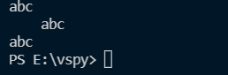

顶格写入print，顶格输出

**大小写转换**

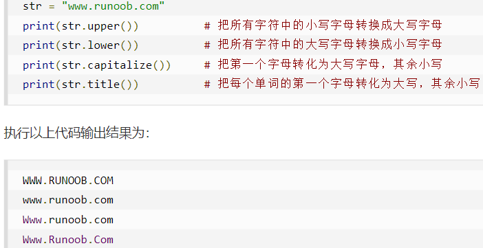


当往strip里面传入字符串的时候，只要字符串首尾的字符存在于传入的字符串中，就会被删除（此处不是首尾的字符串序列和传入的字符串序列相同）

```python
str = "00000003210Runoob01230000000"
print(str.strip( '0' ))  # 去除首尾字符 0
print(str)

str2 = "   Runoob      "# 去除首尾空格
print(str2.strip())

str3 = "123abcrunoob321"
print(str3.strip( '12' ))  # 字符序列为 12

print(str3)
```

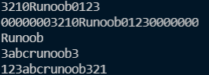


注：在使用以上方法返回的是新字符串，并没有更改原来字符串的内容

字符串str还有另外两种类似的方法lstrip()和rstrip()。第一个是只删头，第二个是只删尾巴，用法类似。


`isspace()`方法判断字符串是否全部为空格

```python
str.isspace()
```


#### 布尔值

布尔值和布尔代数的表示完全一致，一个布尔值只有`True`、`False`两种值，要么是`True`，要么是`False`，在Python中，可以直接用`True`、`False`表示布尔值（请注意大小写），也可以通过布尔运算计算出来：

```
>>> True
True
>>> False
False
>>> 3 > 2
True
>>> 3 > 5
False
```

布尔值可以用`and`、`or`和`not`运算。

`and`运算是与运算，只有所有都为`True`，`and`运算结果才是`True`：

```python
>>> True and True
True
>>> True and False
False
>>> False and False
False
>>> 5 > 3 and 3 > 1
True
```

`or`运算是或运算，只要其中有一个为`True`，`or`运算结果就是`True`：

```python
>>> True or True
True
>>> True or False
True
>>> False or False
False
>>> 5 > 3 or 1 > 3
True
```

`not`运算是非运算，它是一个单目运算符，把`True`变成`False`，`False`变成`True`：

```python
>>> not True
False
>>> not False
True
>>> not 1 > 2
True
```

布尔值经常用在条件判断中，比如：

```python
if age >= 18:
    print('adult')
else:
    print('teenager')
```

#### 空值

空值是Python里一个特殊的值，用`None`表示。`None`不能理解为`0`，因为`0`是有意义的，而`None`是一个特殊的空值。

此外，Python还提供了列表、字典等多种数据类型，还允许创建自定义数据类型，我们后面会继续讲到。

####变量

变量的概念基本上和初中代数的方程变量是一致的，只是在计算机程序中，变量不仅可以是数字，还可以是任意数据类型。

变量在程序中就是用一个变量名表示了，变量名必须是大小写英文、数字和`_`的组合，且不能用数字开头，比如：

```
a = 1
```

变量`a`是一个整数。

```
t_007 = 'T007'
```

变量`t_007`是一个字符串。

```
Answer = True
```

变量`Answer`是一个布尔值`True`。

在Python中，等号`=`是赋值语句，可以把任意数据类型赋值给变量，同一个变量可以反复赋值，而且可以是不同类型的变量。

在Python中，等号`=`是赋值语句，可以把任意数据类型赋值给变量，同一个变量可以反复赋值，而且可以是不同类型的变量，例如：

```python
a = 123 # a是整数
print(a)
a = 'ABC' # a变为字符串
print(a)
```

这种变量本身类型不固定的语言称之为*动态语言*，与之对应的是*静态语言*。静态语言在定义变量时必须指定变量类型，如果赋值的时候类型不匹配，就会报错。例如Java是静态语言，赋值语句如下（// 表示注释）：

```Java
int a = 123; // a是整数类型变量
a = "ABC"; // 错误：不能把字符串赋给整型变量
```

和静态语言相比，动态语言更灵活，就是这个原因。

最后，理解变量在计算机内存中的表示也非常重要。当我们写：

```python
a = 'ABC'
```

时，Python解释器干了两件事情：

1. 在内存中创建了一个`'ABC'`的字符串；
2. 在内存中创建了一个名为`a`的变量，并把它指向`'ABC'`。

也可以把一个变量`a`赋值给另一个变量`b`，这个操作实际上是把变量`b`指向变量`a`所指向的数据，例如下面的代码：

```python
a = 'ABC'
b = a
a = 'XYZ'
print(b)a = 'ABC'
b = a
a = 'XYZ'
print(b)
```

最后一行打印出变量`b`的内容到底是`'ABC'`呢还是`'XYZ'`？如果从数学意义上理解，就会错误地得出`b`和`a`相同，也应该是`'XYZ'`，但实际上`b`的值是`'ABC'`，让我们一行一行地执行代码，就可以看到到底发生了什么事：

执行`a = 'ABC'`，解释器创建了字符串`'ABC'`和变量`a`，并把`a`指向`'ABC'`：

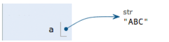

执行`b = a`，解释器创建了变量`b`，并把`b`指向`a`指向的字符串`'ABC'`：

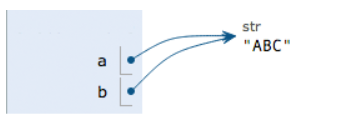

执行`a = 'XYZ'`，解释器创建了字符串'XYZ'，并把`a`的指向改为`'XYZ'`，但`b`并没有更改：

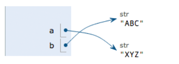

所以，最后打印变量`b`的结果自然是`'ABC'`了。

####常量

所谓常量就是不能变的变量，比如常用的数学常数π就是一个常量。在Python中，通常用全部大写的变量名表示常量：

```
PI = 3.14159265359
```

但事实上`PI`仍然是一个变量，Python根本没有任何机制保证`PI`不会被改变，所以，用全部大写的变量名表示常量只是一个习惯上的用法，如果你一定要改变变量`PI`的值，也没人能拦住你。

最后解释一下整数的除法为什么也是精确的。在Python中，有两种除法，一种除法是`/`：

```python
>>> 10 / 3
3.3333333333333335
```

`/`除法计算结果是浮点数，即使是两个整数恰好整除，结果也是浮点数：

```python
>>> 9 / 3
3.0
```

还有一种除法是`//`，称为地板除，两个整数的除法仍然是整数：

```python
>>> 10 // 3
3
```

你没有看错，整数的地板除`//`永远是整数，即使除不尽。要做精确的除法，使用`/`就可以。

因为`//`除法只取结果的整数部分，所以Python还提供一个余数运算，可以得到两个整数相除的余数：

```python
>>> 10 % 3
1
```

无论整数做`//`除法还是取余数，结果永远是整数，所以，整数运算结果永远是精确的。

### 字符串和编码

#### 字符编码

我们已经讲过了，字符串也是一种数据类型，但是，字符串比较特殊的是还有一个编码问题。

因为计算机只能处理数字，如果要处理文本，就必须先把文本转换为数字才能处理。最早的计算机在设计时采用8个比特（bit）作为一个字节（byte），所以，一个字节能表示的最大的整数就是255（二进制11111111=十进制255），如果要表示更大的整数，就必须用更多的字节。比如两个字节可以表示的最大整数是`65535`，4个字节可以表示的最大整数是`4294967295`。

由于计算机是美国人发明的，因此，最早只有127个字符被编码到计算机里，也就是大小写英文字母、数字和一些符号，这个编码表被称为`ASCII`编码，比如大写字母`A`的编码是`65`，小写字母`z`的编码是`122`。

但是要处理中文显然一个字节是不够的，至少需要两个字节，而且还不能和ASCII编码冲突，所以，中国制定了`GB2312`编码，用来把中文编进去。

你可以想得到的是，全世界有上百种语言，日本把日文编到`Shift_JIS`里，韩国把韩文编到`Euc-kr`里，各国有各国的标准，就会不可避免地出现冲突，结果就是，在多语言混合的文本中，显示出来会有乱码。

因此，Unicode字符集应运而生。Unicode把所有语言都统一到一套编码里，这样就不会再有乱码问题了。

Unicode标准也在不断发展，但最常用的是UCS-16编码，用两个字节表示一个字符（如果要用到非常偏僻的字符，就需要4个字节）。现代操作系统和大多数编程语言都直接支持Unicode。

现在，捋一捋ASCII编码和Unicode编码的区别：ASCII编码是1个字节，而Unicode编码通常是2个字节。

字母`A`用ASCII编码是十进制的`65`，二进制的`01000001`；

字符`0`用ASCII编码是十进制的`48`，二进制的`00110000`，注意字符`'0'`和整数`0`是不同的；

汉字`中`已经超出了ASCII编码的范围，用Unicode编码是十进制的`20013`，二进制的`01001110 00101101`。

你可以猜测，如果把ASCII编码的`A`用Unicode编码，只需要在前面补0就可以，因此，`A`的Unicode编码是`00000000 01000001`。

新的问题又出现了：如果统一成Unicode编码，乱码问题从此消失了。但是，如果你写的文本基本上全部是英文的话，用Unicode编码比ASCII编码需要多一倍的存储空间，在存储和传输上就十分不划算。

所以，本着节约的精神，又出现了把Unicode编码转化为“可变长编码”的`UTF-8`编码。UTF-8编码把一个Unicode字符根据不同的数字大小编码成1-6个字节，常用的英文字母被编码成1个字节，汉字通常是3个字节，只有很生僻的字符才会被编码成4-6个字节。如果你要传输的文本包含大量英文字符，用UTF-8编码就能节省空间：

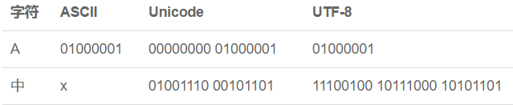

搞清楚了ASCII、Unicode和UTF-8的关系，我们就可以总结一下现在计算机系统通用的字符编码工作方式：

**在计算机内存中，统一使用Unicode编码，当需要保存到硬盘或者需要传输的时候，就转换为UTF-8编码**。

用记事本编辑的时候，从文件读取的UTF-8字符被转换为Unicode字符到内存里，编辑完成后，保存的时候再把Unicode转换为UTF-8保存到文件：

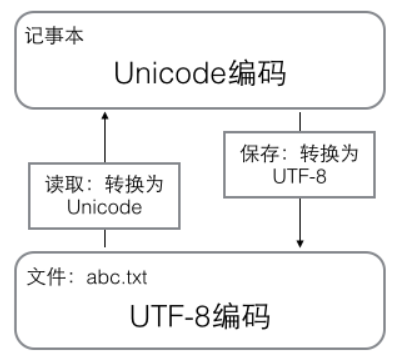

浏览网页的时候，服务器会把动态生成的Unicode内容转换为UTF-8再传输到浏览器

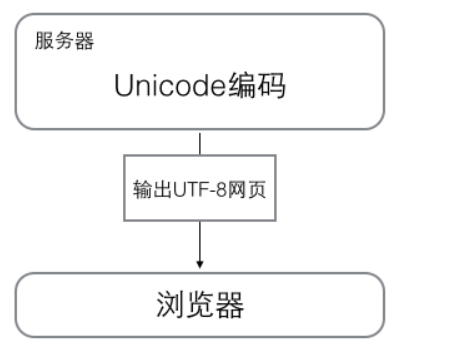

所以你看到很多网页的源码上会有类似`<meta charset="UTF-8" />`的信息，表示该网页正是用的UTF-8编码。

####Python的字符串

在最新的Python 3版本中，字符串是以Unicode编码的，也就是说，Python的字符串支持多语言，例如：

```python
>>> print('包含中文的str')
包含中文的str
```

对于单个字符的编码，Python提供了`ord()`函数获取字符的整数表示，`chr()`函数把编码转换为对应的字符：

```python
>>> ord('A')
65
>>> ord('中')
20013
>>> chr(66)
'B'
>>> chr(25991)
'文'
```

如果知道字符的整数编码，还可以用十六进制这么写`str`：

```markdown
>>> '\u4e2d\u6587'
'中文'
```

由于Python的字符串类型是`str`，在内存中以Unicode表示，一个字符对应若干个字节。如果要在网络上传输，或者保存到磁盘上，就需要把`str`变为以字节为单位的`bytes`。

Python对`bytes`类型的数据用带`b`前缀的单引号或双引号表示：

```python
x = b'ABC'
```

要注意区分`'ABC'`和`b'ABC'`，前者是`str`，后者虽然内容显示得和前者一样，但`bytes`的每个字符都只占用一个字节。

以Unicode表示的`str`通过`encode()`方法可以编码为指定的`bytes`，例如：

```markdown
>>> 'ABC'.encode('ascii')
b'ABC'
>>> '中文'.encode('utf-8')
b'\xe4\xb8\xad\xe6\x96\x87'
>>> '中文'.encode('ascii')
Traceback (most recent call last):
  File "<stdin>", line 1, in <module>
UnicodeEncodeError: 'ascii' codec can't encode characters in position 0-1: ordinal not in range(128)
```

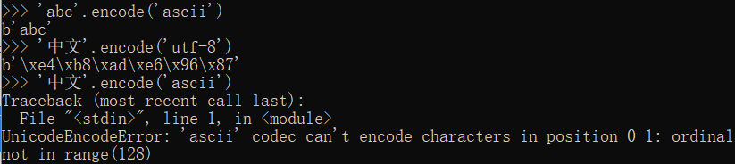

纯英文的`str`可以用`ASCII`编码为`bytes`，内容是一样的，含有中文的`str`可以用`UTF-8`编码为`bytes`。含有中文的`str`无法用`ASCII`编码，因为中文编码的范围超过了`ASCII`编码的范围，Python会报错。

在`bytes`中，无法显示为ASCII字符的字节，用`\x##`显示。

反过来，如果我们从网络或磁盘上读取了字节流，那么读到的数据就是`bytes`。要把`bytes`变为`str`，就需要用`decode()`方法：

```markdown
>>> b'ABC'.decode('ascii')
'ABC'
>>> b'\xe4\xb8\xad\xe6\x96\x87'.decode('utf-8')
'中文'
```

如果`bytes`中包含无法解码的字节，`decode()`方法会报错：

```markdown
>>> b'\xe4\xb8\xad\xff'.decode('utf-8')
Traceback (most recent call last):
  ...
UnicodeDecodeError: 'utf-8' codec can't decode byte 0xff in position 3: invalid start byte
```

如果`bytes`中只有一小部分无效的字节，可以传入`errors='ignore'`忽略错误的字节：

```markdown
>>> b'\xe4\xb8\xad\xff'.decode('utf-8', errors='ignore')
'中'
```

要计算`str`包含多少个字符，可以用`len()`函数：

```markdown
>>> len('ABC')
3
>>> len('中文')
2
```

`len()`函数计算的是`str`的字符数，如果换成`bytes`，`len()`函数就计算字节数：

```markdown
>>> len(b'ABC')
3
>>> len(b'\xe4\xb8\xad\xe6\x96\x87')
6
>>> len('中文'.encode('utf-8'))
6
```

可见，1个中文字符经过UTF-8编码后通常会占用3个字节，而1个英文字符只占用1个字节。

在操作字符串时，我们经常遇到`str`和`bytes`的互相转换。为了避免乱码问题，应当始终坚持使用UTF-8编码对`str`和`bytes`进行转换。

由于Python源代码也是一个文本文件，所以，当你的源代码中包含中文的时候，在保存源代码时，就需要务必指定保存为UTF-8编码。当Python解释器读取源代码时，为了让它按UTF-8编码读取，我们通常在文件开头写上这两行：

```python
#!/usr/bin/env python3
# -*- coding: utf-8 -*-
```

第一行注释是为了告诉Linux/OS X系统，这是一个Python可执行程序，Windows系统会忽略这个注释；

第二行注释是为了告诉Python解释器，按照UTF-8编码读取源代码，否则，你在源代码中写的中文输出可能会有乱码。

申明了UTF-8编码并不意味着你的`.py`文件就是UTF-8编码的，必须并且要确保文本编辑器正在使用UTF-8 without BOM编码：

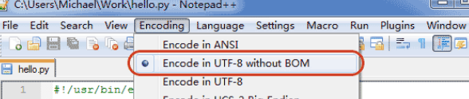

如果`.py`文件本身使用UTF-8编码，并且也申明了`# -*- coding: utf-8 -*-`，打开命令提示符测试就可以正常显示中文：

#### 格式化

最后一个常见的问题是如何输出格式化的字符串。我们经常会输出类似`'亲爱的xxx你好！你xx月的话费是xx，余额是xx'`之类的字符串，而xxx的内容都是根据变量变化的，所以，需要一种简便的格式化字符串的方式。

在Python中，采用的格式化方式和C语言是一致的，用`%`实现，举例如下：

```markdown
>>> 'Hello, %s' % 'world'
'Hello, world'
>>> 'Hi, %s, you have $%d.' % ('Michael', 1000000)
'Hi, Michael, you have $1000000.'
```

你可能猜到了，`%`运算符就是用来格式化字符串的。在字符串内部，`%s`表示用字符串替换，`%d`表示用整数替换，有几个`%?`占位符，后面就跟几个变量或者值，顺序要对应好。如果只有一个`%?`，括号可以省略。

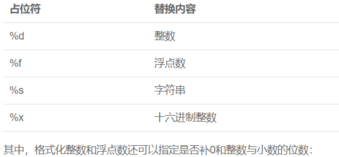

```markdown
print('%2d-%02d' % (3, 1))
print('%.2f' % 3.1415926)

 3-01
3.14
```

如果你不太确定应该用什么，`%s`永远起作用，它会把任何数据类型转换为字符串：

```markdown
>>> 'Age: %s. Gender: %s' % (25, True)
'Age: 25. Gender: True'
```

有些时候，字符串里面的`%`是一个普通字符怎么办？这个时候就需要转义，用`%%`来表示一个`%`：

```markdown
>>> 'growth rate: %d %%' % 7
'growth rate: 7 %'
```

######format()

另一种格式化字符串的方法是使用字符串的`format()`方法，它会用传入的参数依次替换字符串内的占位符`{0}`、`{1}`……，不过这种方式写起来比%要麻烦得多：

```
>>> 'Hello, {0}, 成绩提升了 {1:.1f}%'.format('小明', 17.125)
'Hello, 小明, 成绩提升了 17.1%'
```


format函数可以接受无限个参数，位置可以不按顺序

```python
print("{} {}".format("hello", "world"))  # 不设置指定位置，按默认顺序
#hello world

print("{0} {1}".format("hello", "world"))  # 设置指定位置
#hello world

print("{1} {0} {1}".format("hello", "world"))  # 设置指定位置
#world hello world
```

也可以设置参数

```python
print("网站名：{name}, 地址 {url}".format(name="菜鸟教程", url="www.runoob.com"))


# 通过字典设置参数
site = {"name": "菜鸟教程", "url": "www.runoob.com"}
print("网站名：{name}, 地址 {url}".format(**site))


# 通过列表索引设置参数
my_list = ['菜鸟教程', 'www.runoob.com']
print("网站名：{0[0]}, 地址 {0[1]}".format(my_list))  # "0" 是必须的

#网站名：菜鸟教程, 地址 www.runoob.com
```


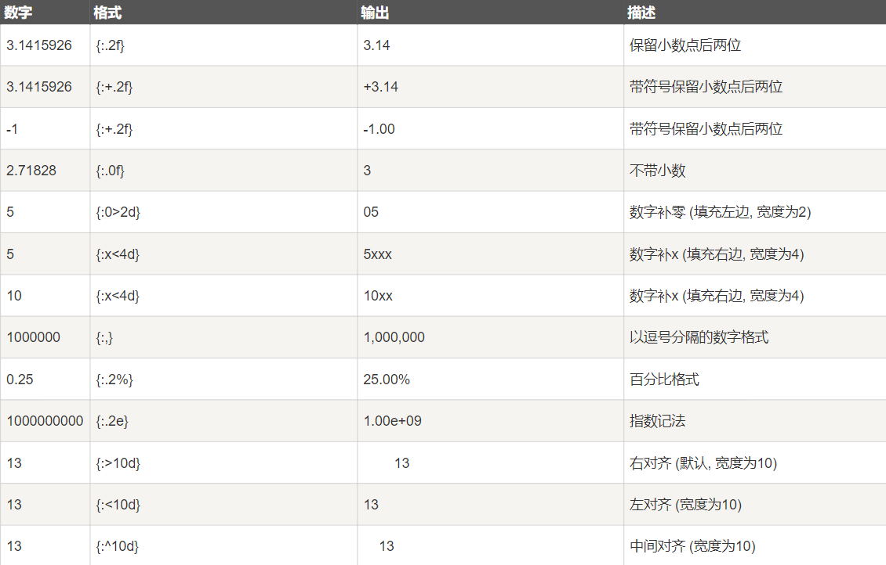

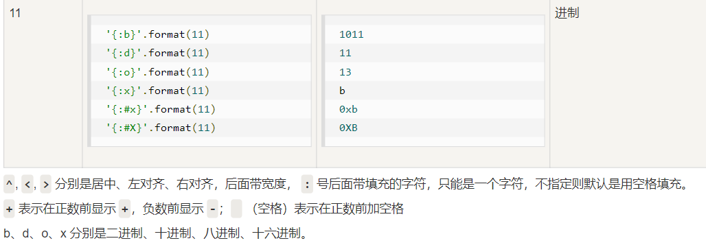

直接{:.4}的话，就是保留4位小数


此外我们可以使用大括号 **{}** 来转义大括号，如下实例：

```python
print ("{} 对应的位置是 {{0}}".format("runoob"))
#runoob 对应的位置是 {0}
```


######f-string

最后一种格式化字符串的方法是使用以`f`开头的字符串，称之为`f-string`，它和普通字符串不同之处在于，字符串如果包含`{xxx}`，就会以对应的变量替换：

```markdown
>>> r = 2.5
>>> s = 3.14 * r ** 2
>>> print(f'The area of a circle with radius {r} is {s:.2f}')
The area of a circle with radius 2.5 is 19.62
```

上述代码中，`{r}`被变量`r`的值替换，`{s:.2f}`被变量`s`的值替换，并且`:`后面的`.2f`指定了格式化参数（即保留两位小数），因此，`{s:.2f}`的替换结果是`19.62`。


### 使用list和tuple

#### list

Python内置的一种数据类型是列表：list。list是一种有序的集合，可以随时添加和删除其中的元素。

比如，列出班里所有同学的名字，就可以用一个list表示：

```markdown
>>> classmates = ['Michael', 'Bob', 'Tracy']
>>> classmates
['Michael', 'Bob', 'Tracy']
```

可以直接使用`print`直接打印输出列表

变量`classmates`就是一个list。用`len()`函数可以获得list元素的个数：

```markdown
>>> len(classmates)
3
```

变量`classmates`就是一个list。用`len()`函数可以获得list元素的个数：

```markdown
>>> len(classmates)
3
```

用索引来访问list中每一个位置的元素，记得索引是从`0`开始的：

```markdown
>>> classmates[0]
'Michael'
>>> classmates[1]
'Bob'
>>> classmates[2]
'Tracy'
>>> classmates[3]
Traceback (most recent call last):
  File "<stdin>", line 1, in <module>
IndexError: list index out of range
```

当索引超出了范围时，Python会报一个`IndexError`错误，所以，要确保索引不要越界，记得最后一个元素的索引是`len(classmates) - 1`。

如果要取最后一个元素，除了计算索引位置外，还可以用`-1`做索引，直接获取最后一个元素：

```markdown
>>> classmates[-1]
'Tracy'
```

以此类推，可以获取倒数第2个、倒数第3个：

```markdown
>>> classmates[-2]
'Bob'
>>> classmates[-3]
'Michael'
>>> classmates[-4]
Traceback (most recent call last):
  File "<stdin>", line 1, in <module>
IndexError: list index out of range
```

list是一个可变的有序表，所以，可以往list中追加元素到末尾：

```markdown
>>> classmates.append('Adam')
>>> classmates
['Michael', 'Bob', 'Tracy', 'Adam']
```

也可以把元素插入到指定的位置，比如索引号为`1`的位置：

```markdown
>>> classmates.insert(1, 'Jack')
>>> classmates
['Michael', 'Jack', 'Bob', 'Tracy', 'Adam']
```

要删除list末尾的元素，用`pop()`方法：

```markdown
>>> classmates.pop()
'Adam'
>>> classmates
['Michael', 'Jack', 'Bob', 'Tracy']
```

要删除指定位置的元素，用`pop(i)`方法，其中`i`是索引位置：

```markdown
>>> classmates.pop(1)
'Jack'
>>> classmates
['Michael', 'Bob', 'Tracy']
```

要把某个元素替换成别的元素，可以直接赋值给对应的索引位置：

```markdown
>>> classmates[1] = 'Sarah'
>>> classmates
['Michael', 'Sarah', 'Tracy']
```

list里面的元素的数据类型也可以不同，比如：

```markdown
>>> L = ['Apple', 123, True]
```

list元素也可以是另一个list，比如：

```markdown
>>> s = ['python', 'java', ['asp', 'php'], 'scheme']
>>> len(s)
4
```

要注意`s`只有4个元素，其中`s[2]`又是一个list，如果拆开写就更容易理解了：

```
>>> p = ['asp', 'php']
>>> s = ['python', 'java', p, 'scheme']
```

要拿到`'php'`可以写`p[1]`或者`s[2][1]`，因此`s`可以看成是一个二维数组，类似的还有三维、四维……数组，不过很少用到。

如果一个list中一个元素也没有，就是一个空的list，它的长度为0：

```markdown
>>> L = []
>>> len(L)
0
```

**小结**：list的函数

* len：求长度/元素个数
* []：方括号，索引，取相应位置上的元素
* append：在list末尾追加元素
* insert：在指定位置插入元素
* pop：删除末尾元素或者指定位置的元素


#### tuple

另一种有序列表叫元组：tuple。tuple和list非常类似，但是tuple一旦初始化就不能修改，比如同样是列出同学的名字：

```
>>> classmates = ('Michael', 'Bob', 'Tracy')
```

现在，classmates这个tuple不能变了，它也没有append()，insert()这样的方法。其他获取元素的方法和list是一样的，你可以正常地使用`classmates[0]`，`classmates[-1]`，但不能赋值成另外的元素。

不可变的tuple有什么意义？因为tuple不可变，所以代码更安全。如果可能，能用tuple代替list就尽量用tuple。

tuple的陷阱：当你定义一个tuple时，在定义的时候，tuple的元素就必须被确定下来，比如：

```markdown
>>> t = (1, 2)
>>> t
(1, 2)
```

如果要定义一个空的tuple，可以写成`()`：

```
>>> t = ()
>>> t
()
```

但是，要定义一个只有1个元素的tuple，如果你这么定义：

```markdown
>>> t = (1)
>>> t
1
```

定义的不是tuple，是`1`这个数！这是因为括号`()`既可以表示tuple，又可以表示数学公式中的小括号，这就产生了歧义，因此，Python规定，这种情况下，按小括号进行计算，计算结果自然是`1`。

所以，只有1个元素的tuple定义时必须加一个逗号`,`，来消除歧义：

```markdown
>>> t = (1,)
>>> t
(1,)
```

Python在显示只有1个元素的tuple时，也会加一个逗号`,`，以免你误解成数学计算意义上的括号。

最后来看一个“可变的”tuple：

```markdown
>>> t = ('a', 'b', ['A', 'B'])
>>> t[2][0] = 'X'
>>> t[2][1] = 'Y'
>>> t
('a', 'b', ['X', 'Y'])
```

这个tuple定义的时候有3个元素，分别是`'a'`，`'b'`和一个list。不是说tuple一旦定义后就不可变了吗？怎么后来又变了？

别急，我们先看看定义的时候tuple包含的3个元素：

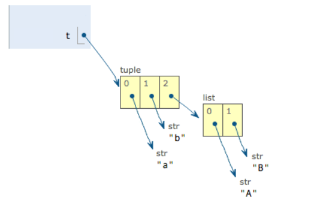

当我们把list的元素`'A'`和`'B'`修改为`'X'`和`'Y'`后，tuple变为：

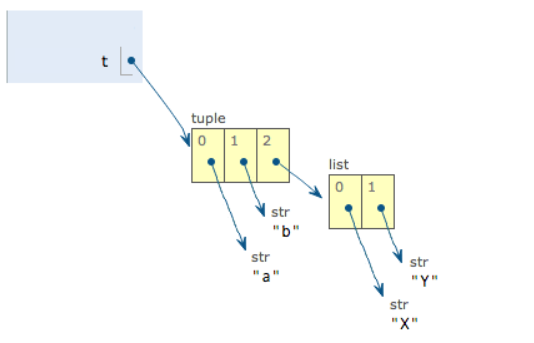

表面上看，tuple的元素确实变了，但其实变的不是tuple的元素，而是list的元素。tuple一开始指向的list并没有改成别的list，所以，tuple所谓的“不变”是说，tuple的每个元素，指向永远不变。即指向`'a'`，就不能改成指向`'b'`，指向一个list，就不能改成指向其他对象，但指向的这个list本身是可变的！

理解了“指向不变”后，要创建一个内容也不变的tuple怎么做？那就必须保证tuple的每一个元素本身也不能变。


### 条件判断

计算机之所以能做很多自动化的任务，因为它可以自己做条件判断。

比如，输入用户年龄，根据年龄打印不同的内容，在Python程序中，用`if`语句实现：

```
age = 20
if age >= 18:
    print('your age is', age)
    print('adult')
```

根据Python的缩进规则，如果`if`语句判断是`True`，就把缩进的两行print语句执行了，否则，什么也不做。

也可以给`if`添加一个`else`语句，意思是，如果`if`判断是`False`，不要执行`if`的内容，去把`else`执行了：

```
age = 3
if age >= 18:
    print('your age is', age)
    print('adult')
else:
    print('your age is', age)
    print('teenager')
```

注意不要少写了冒号`:`。

当然上面的判断是很粗略的，完全可以用`elif`做更细致的判断：

```
age = 3
if age >= 18:
    print('adult')
elif age >= 6:
    print('teenager')
else:
    print('kid')
```

`elif`是`else if`的缩写，完全可以有多个`elif`，所以`if`语句的完整形式就是：

```
if <条件判断1>:
    <执行1>
elif <条件判断2>:
    <执行2>
elif <条件判断3>:
    <执行3>
else:
    <执行4>
```

`if`语句执行有个特点，它是从上往下判断，如果在某个判断上是`True`，把该判断对应的语句执行后，就忽略掉剩下的`elif`和`else`，所以，请测试并解释为什么下面的程序打印的是`teenager`：

```
age = 20
if age >= 6:
    print('teenager')
elif age >= 18:
    print('adult')
else:
    print('kid')
```

`if`判断条件还可以简写，比如写：

```
if x:
    print('True')
```

只要`x`是非零数值、非空字符串、非空list等，就判断为`True`，否则为`False`。

#### 再议input

最后看一个有问题的条件判断。很多同学会用`input()`读取用户的输入，这样可以自己输入，程序运行得更有意思：

```
birth = input('birth: ')
if birth < 2000:
    print('00前')
else:
    print('00后')
```

输入`1982`，结果报错：

```
Traceback (most recent call last):
  File "<stdin>", line 1, in <module>
TypeError: unorderable types: str() > int()
```

这是因为`input()`返回的数据类型是`str`，`str`不能直接和整数比较，必须先把`str`转换成整数。Python提供了`int()`函数来完成这件事情：

```
s = input('birth: ')
birth = int(s)
if birth < 2000:
    print('00前')
else:
    print('00后')
```

再次运行，就可以得到正确地结果。但是，如果输入`abc`呢？又会得到一个错误信息：

```
Traceback (most recent call last):
  File "<stdin>", line 1, in <module>
ValueError: invalid literal for int() with base 10: 'abc'
```

原来`int()`函数发现一个字符串并不是合法的数字时就会报错，程序就退出了。


### 循环

要计算1+2+3，我们可以直接写表达式：

```
>>> 1 + 2 + 3
6
```

要计算1+2+3+...+10，勉强也能写出来。

但是，要计算1+2+3+...+10000，直接写表达式就不可能了。

为了让计算机能计算成千上万次的重复运算，我们就需要循环语句。

####for

Python的循环有两种，一种是for...in循环，依次把list或tuple中的每个元素迭代出来，看例子：

```
names = ['Michael', 'Bob', 'Tracy']
for name in names:
    print(name)
```

执行这段代码，会依次打印`names`的每一个元素：

```
Michael
Bob
Tracy
```

所以`for x in ...`循环就是把每个元素代入变量`x`，然后执行缩进块的语句。

再比如我们想计算1-10的整数之和，可以用一个`sum`变量做累加：

```python
sum = 0
for x in [1, 2, 3, 4, 5, 6, 7, 8, 9, 10]:
    sum = sum + x
print(sum)
```

如果要计算1-100的整数之和，从1写到100有点困难，幸好Python提供一个`range()`函数，可以生成一个整数序列，再通过`list()`函数可以转换为list。比如`range(5)`生成的序列是从0开始小于5的整数：

```
>>> list(range(5))
[0, 1, 2, 3, 4]
```

`range(101)`就可以生成0-100的整数序列，计算如下：

```python
sum = 0
for x in range(101):
    sum = sum + x
print(sum)
```

####while

第二种循环是while循环，只要条件满足，就不断循环，条件不满足时退出循环。比如我们要计算100以内所有奇数之和，可以用while循环实现：

```python
sum = 0
n = 99
while n > 0:
    sum = sum + n
    n = n - 2
print(sum)
```

在循环内部变量`n`不断自减，直到变为`-1`时，不再满足while条件，循环退出。


#### break

在循环中，`break`语句可以提前退出循环。例如，本来要循环打印1～100的数字：

```
n = 1
while n <= 100:
    print(n)
    n = n + 1
print('END')
```

上面的代码可以打印出1~100。

如果要提前结束循环，可以用`break`语句：

```
n = 1
while n <= 100:
    if n > 10: # 当n = 11时，条件满足，执行break语句
        break # break语句会结束当前循环
    print(n)
    n = n + 1
print('END')
```

执行上面的代码可以看到，打印出1~10后，紧接着打印`END`，程序结束。

可见`break`的作用是提前结束循环。


#### continue

在循环过程中，也可以通过`continue`语句，跳过当前的这次循环，直接开始下一次循环。

```
n = 0
while n < 10:
    n = n + 1
    print(n)
```

上面的程序可以打印出1～10。但是，如果我们想只打印奇数，可以用`continue`语句跳过某些循环：

```
n = 0
while n < 10:
    n = n + 1
    if n % 2 == 0: # 如果n是偶数，执行continue语句
        continue # continue语句会直接继续下一轮循环，后续的print()语句不会执行
    print(n)
```

执行上面的代码可以看到，打印的不再是1～10，而是1，3，5，7，9。

可见`continue`的作用是提前结束本轮循环，并直接开始下一轮循环。


### dict和set

#### dict

Python内置了字典：dict的支持，dict全称dictionary，在其他语言中也称为map，使用键-值（key-value）存储，具有极快的查找速度。

键必须不可变，所以可以用数字，字符串或元组充当，所以用列表就不行

举个例子，假设要根据同学的名字查找对应的成绩，如果用list实现，需要两个list：

```
names = ['Michael', 'Bob', 'Tracy']
scores = [95, 75, 85]
```

给定一个名字，要查找对应的成绩，就先要在names中找到对应的位置，再从scores取出对应的成绩，list越长，耗时越长。

如果用dict实现，只需要一个“名字”-“成绩”的对照表，直接根据名字查找成绩，无论这个表有多大，查找速度都不会变慢。用Python写一个dict如下：

```markdown
>>> d = {'Michael': 95, 'Bob': 75, 'Tracy': 85}
>>> d['Michael']
95
```

为什么dict查找速度这么快？因为dict的实现原理和查字典是一样的。假设字典包含了1万个汉字，我们要查某一个字，一个办法是把字典从第一页往后翻，直到找到我们想要的字为止，这种方法就是在list中查找元素的方法，list越大，查找越慢。

第二种方法是先在字典的索引表里（比如部首表）查这个字对应的页码，然后直接翻到该页，找到这个字。无论找哪个字，这种查找速度都非常快，不会随着字典大小的增加而变慢。

dict就是第二种实现方式，给定一个名字，比如`'Michael'`，dict在内部就可以直接计算出`Michael`对应的存放成绩的“页码”，也就是`95`这个数字存放的内存地址，直接取出来，所以速度非常快。

你可以猜到，这种key-value存储方式，在放进去的时候，必须根据key算出value的存放位置，这样，取的时候才能根据key直接拿到value。

把数据放入dict的方法，除了初始化时指定外，还可以通过key放入（修改或增加已有的键值对）：

```
>>> d['Adam'] = 67
>>> d['Adam']
67
```

由于一个key只能对应一个value，所以，多次对一个key放入value，后面的值会把前面的值冲掉：

```
>>> d['Jack'] = 90
>>> d['Jack']
90
>>> d['Jack'] = 88
>>> d['Jack']
88
```

如果key不存在，dict就会报错：

```markdown
>>> d['Thomas']
Traceback (most recent call last):
  File "<stdin>", line 1, in <module>
KeyError: 'Thomas'
```

要避免key不存在的错误，有两种办法，一是通过`in`判断key是否存在：

```markdown
>>> 'Thomas' in d
False
```

此种判断元素是否在容器里的方法可以用到list、tuple等中

```
>>> d.get('Thomas')
>>> d.get('Thomas', -1)
-1
```

注意：返回`None`的时候Python的交互环境不显示结果。

删除字典元素使用`del`

```python
del d['Adam']
```


清空字典的所有条目用`clear`方法，删除字典使用`del`

```python
d.clear()
del d
```


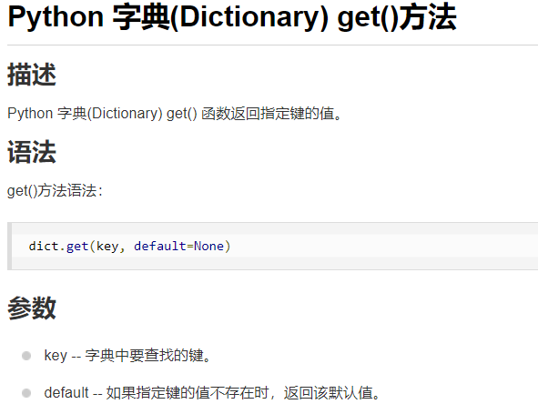

要删除一个key，用`pop(key)`方法，对应的value也会从dict中删除：

```markdown
>>> d.pop('Bob')
75
>>> d
{'Michael': 95, 'Tracy': 85}
```

请务必注意，dict内部存放的顺序和key放入的顺序是没有关系的。

和list比较，dict有以下几个特点：

1. 查找和插入的速度极快，不会随着key的增加而变慢；
2. 需要占用大量的内存，内存浪费多。

而list相反：

1. 查找和插入的时间随着元素的增加而增加；
2. 占用空间小，浪费内存很少。

所以，dict是用空间来换取时间的一种方法。

dict可以用在需要高速查找的很多地方，在Python代码中几乎无处不在，正确使用dict非常重要，需要牢记的第一条就是dict的key必须是**不可变对象**。

这是因为dict根据key来计算value的存储位置，如果每次计算相同的key得出的结果不同，那dict内部就完全混乱了。这个通过key计算位置的算法称为哈希算法（Hash）。

要保证hash的正确性，作为key的对象就不能变。在Python中，字符串、整数等都是不可变的，因此，可以放心地作为key。而list是可变的，就不能作为key：

```markdown
>>> key = [1, 2, 3]
>>> d[key] = 'a list'
Traceback (most recent call last):
  File "<stdin>", line 1, in <module>
TypeError: unhashable type: 'list'
```

#### set

set和dict类似，也是一组key的集合，但不存储value。由于key不能重复，所以，在set中，没有重复的key。

要创建一个set，需要提供一个list作为输入集合：

```
>>> s = set([1, 2, 3])
>>> s
{1, 2, 3}
```

注意，传入的参数`[1, 2, 3]`是一个list，而显示的`{1, 2, 3}`只是告诉你这个set内部有1，2，3这3个元素，显示的顺序也不表示set是有序的。。

重复元素在set中自动被过滤：

```markdown
>>> s = set([1, 1, 2, 2, 3, 3])
>>> s
{1, 2, 3}
```

通过`add(key)`方法可以添加元素到set中，可以重复添加，但不会有效果：

```
>>> s.add(4)
>>> s
{1, 2, 3, 4}
>>> s.add(4)
>>> s
{1, 2, 3, 4}
```

通过`remove(key)`方法可以删除元素：

```
>>> s.remove(4)
>>> s
{1, 2, 3}
```

set可以看成数学意义上的无序和无重复元素的集合，因此，两个set可以做数学意义上的交集、并集等操作：

```
>>> s1 = set([1, 2, 3])
>>> s2 = set([2, 3, 4])
>>> s1 & s2
{2, 3}
>>> s1 | s2
{1, 2, 3, 4}
```

set和dict的唯一区别仅在于没有存储对应的value，但是，set的原理和dict一样，所以，同样不可以放入可变对象，因为无法判断两个可变对象是否相等，也就无法保证set内部“不会有重复元素”。试试把list放入set，看看是否会报错。

#### 再议不可变对象

上面我们讲了，str是不变对象，而list是可变对象。

对于可变对象，比如list，对list进行操作，list内部的内容是会变化的，比如：

```
>>> a = ['c', 'b', 'a']
>>> a.sort()
>>> a
['a', 'b', 'c']
```

而对于不可变对象，比如str，对str进行操作呢：

```markdown
>>> a = 'abc'
>>> a.replace('a', 'A')
'Abc'
>>> a
'abc'
```

虽然字符串有个`replace()`方法，也确实变出了`'Abc'`，但变量`a`最后仍是`'abc'`，应该怎么理解呢？

我们先把代码改成下面这样：

```
>>> a = 'abc'
>>> b = a.replace('a', 'A')
>>> b
'Abc'
>>> a
'abc'
```

要始终牢记的是，`a`是变量，而`'abc'`才是字符串对象！有些时候，我们经常说，对象`a`的内容是`'abc'`，但其实是指，`a`本身是一个变量，它指向的对象的内容才是`'abc'`：

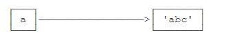

当我们调用`a.replace('a', 'A')`时，实际上调用方法`replace`是作用在字符串对象`'abc'`上的，而这个方法虽然名字叫`replace`，但却没有改变字符串`'abc'`的内容。相反，`replace`方法创建了一个新字符串`'Abc'`并返回，如果我们用变量`b`指向该新字符串，就容易理解了，变量`a`仍指向原有的字符串`'abc'`，但变量`b`却指向新字符串`'Abc'`了：

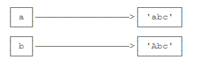

所以，对于不变对象来说，调用对象自身的任意方法，也不会改变该对象自身的内容。相反，这些方法会创建新的对象并返回，这样，就保证了不可变对象本身永远是不可变的。


## 函数

### 调用函数

要调用一个函数，需要知道函数的名称和参数，比如求绝对值的函数`abs`，只有一个参数。

调用`abs`函数：

```markdown
>>> abs(100)
100
>>> abs(-20)
20
>>> abs(12.34)
12.34
```

调用函数的时候，如果传入的参数数量不对，会报`TypeError`的错误，并且Python会明确地告诉你：`abs()`有且仅有1个参数，但给出了两个：

```markdown
>>> abs(1, 2)
Traceback (most recent call last):
  File "<stdin>", line 1, in <module>
TypeError: abs() takes exactly one argument (2 given)
```

如果传入的参数数量是对的，但参数类型不能被函数所接受，也会报`TypeError`的错误，并且给出错误信息：`str`是错误的参数类型：

```markdown
>>> abs('a')
Traceback (most recent call last):
  File "<stdin>", line 1, in <module>
TypeError: bad operand type for abs(): 'str'
```

而`max`函数`max()`可以接收任意多个参数，并返回最大的那个：

```markdown
>>> max(1, 2)
2
>>> max(2, 3, 1, -5)
3
```

#### 数据类型转换

Python内置的常用函数还包括数据类型转换函数，比如`int()`函数可以把其他数据类型转换为整数：

```markdown
>>> int('123')
123
>>> int(12.34)
12
>>> float('12.34')
12.34
>>> str(1.23)
'1.23'
>>> str(100)
'100'
>>> bool(1)
True
>>> bool('')
False
```

函数名其实就是指向一个函数对象的引用，完全可以把函数名赋给一个变量，相当于给这个函数起了一个“别名”：

```markdown
>>> a = abs # 变量a指向abs函数
>>> a(-1) # 所以也可以通过a调用abs函数
1
```


### 定义函数

在Python中，定义一个函数要使用`def`语句，依次写出函数名、括号、括号中的参数和冒号`:`，然后，在缩进块中编写函数体，函数的返回值用`return`语句返回。

我们以自定义一个求绝对值的`my_abs`函数为例：

```python
def my_abs(x):
    if x >= 0:
        return x
    else:
        return -x
```


请注意，函数体内部的语句在执行时，一旦执行到`return`时，函数就执行完毕，并将结果返回。因此，函数内部通过条件判断和循环可以实现非常复杂的逻辑。

如果没有`return`语句，函数执行完毕后也会返回结果，只是结果为`None`。`return None`可以简写为`return`。


#### 空函数

如果想定义一个什么事也不做的空函数，可以用`pass`语句：

```
def nop():
    pass
```

`pass`语句什么都不做，那有什么用？实际上`pass`可以用来作为占位符，比如现在还没想好怎么写函数的代码，就可以先放一个`pass`，让代码能运行起来。

`pass`还可以用在其他语句里，比如：

```
if age >= 18:
    pass
```

缺少了`pass`，代码运行就会有语法错误。


#### 参数检查

调用函数时，如果参数个数不对，Python解释器会自动检查出来，并抛出`TypeError`：

```markdown
>>> my_abs(1, 2)
Traceback (most recent call last):
  File "<stdin>", line 1, in <module>
TypeError: my_abs() takes 1 positional argument but 2 were given
```

但是如果参数类型不对，Python解释器就无法帮我们检查。试试`my_abs`和内置函数`abs`的差别：

```markdown
>>> my_abs('A')
Traceback (most recent call last):
  File "<stdin>", line 1, in <module>
  File "<stdin>", line 2, in my_abs
TypeError: unorderable types: str() >= int()
>>> abs('A')
Traceback (most recent call last):
  File "<stdin>", line 1, in <module>
TypeError: bad operand type for abs(): 'str'
```

当传入了不恰当的参数时，内置函数`abs`会检查出参数错误，而我们定义的`my_abs`没有参数检查，会导致`if`语句出错，出错信息和`abs`不一样。所以，这个函数定义不够完善。

让我们修改一下`my_abs`的定义，对参数类型做检查，只允许整数和浮点数类型的参数。数据类型检查可以用内置函数`isinstance()`实现：

```
def my_abs(x):
    if not isinstance(x, (int, float)):
        raise TypeError('bad operand type')
    if x >= 0:
        return x
    else:
        return -x
```

添加了参数检查后，如果传入错误的参数类型，函数就可以抛出一个错误：

```
>>> my_abs('A')
Traceback (most recent call last):
  File "<stdin>", line 1, in <module>
  File "<stdin>", line 3, in my_abs
TypeError: bad operand type
```


#### 返回多个值

函数可以返回多个值吗？答案是肯定的。

比如在游戏中经常需要从一个点移动到另一个点，给出坐标、位移和角度，就可以计算出新的坐标：

```
import math

def move(x, y, step, angle=0):
    nx = x + step * math.cos(angle)
    ny = y - step * math.sin(angle)
    return nx, ny
```

`import math`语句表示导入`math`包，并允许后续代码引用`math`包里的`sin`、`cos`等函数。

然后，我们就可以同时获得返回值：

```markdown
>>> x, y = move(100, 100, 60, math.pi / 6)
>>> print(x, y)
151.96152422706632 70.0
```

但其实这只是一种假象，Python函数返回的仍然是单一值：

```
>>> r = move(100, 100, 60, math.pi / 6)
>>> print(r)
(151.96152422706632, 70.0)
```

原来返回值是一个tuple！但是，在语法上，返回一个tuple可以省略括号，而多个变量可以同时接收一个tuple，按位置赋给对应的值，所以，Python的函数返回多值其实就是返回一个tuple，但写起来更方便。


### 函数的参数

定义函数的时候，我们把参数的名字和位置确定下来，函数的接口定义就完成了。对于函数的调用者来说，只需要知道如何传递正确的参数，以及函数将返回什么样的值就够了，函数内部的复杂逻辑被封装起来，调用者无需了解。

定义函数的时候，我们把参数的名字和位置确定下来，函数的接口定义就完成了。对于函数的调用者来说，只需要知道如何传递正确的参数，以及函数将返回什么样的值就够了，函数内部的复杂逻辑被封装起来，调用者无需了解。

Python的函数定义非常简单，但灵活度却非常大。除了正常定义的必选参数外，还可以使用默认参数、可变参数和关键字参数，使得函数定义出来的接口，不但能处理复杂的参数，还可以简化调用者的代码。


#### 位置参数

我们先写一个计算x^2^的函数：

```
def power(x):
    return x * x
```

对于`power(x)`函数，参数`x`就是一个位置参数。

当我们调用`power`函数时，必须传入有且仅有的一个参数`x`：

```
>>> power(5)
25
>>> power(15)
225
```

现在，如果我们要计算x^3^怎么办？可以再定义一个`power3`函数，但是如果要计算x^4^、x^5^……怎么办？我们不可能定义无限多个函数。

你也许想到了，可以把`power(x)`修改为`power(x, n)`，用来计算x^n^，说干就干：

```
def power(x, n):
    s = 1
    while n > 0:
        n = n - 1
        s = s * x
    return s
```

对于这个修改后的`power(x, n)`函数，可以计算任意n次方：

```
>>> power(5, 2)
25
>>> power(5, 3)
125
```

修改后的`power(x, n)`函数有两个参数：`x`和`n`，这两个参数都是位置参数，调用函数时，传入的两个值按照位置顺序依次赋给参数`x`和`n`。


#### 默认参数

新的`power(x, n)`函数定义没有问题，但是，旧的调用代码失败了，原因是我们增加了一个参数，导致旧的代码因为缺少一个参数而无法正常调用：

```
>>> power(5)
Traceback (most recent call last):
  File "<stdin>", line 1, in <module>
TypeError: power() missing 1 required positional argument: 'n'
```

Python的错误信息很明确：调用函数`power()`缺少了一个位置参数`n`。

这个时候，默认参数就排上用场了。由于我们经常计算x2，所以，完全可以把第二个参数n的默认值设定为2：

```
def power(x, n=2):
    s = 1
    while n > 0:
        n = n - 1
        s = s * x
    return s
```

这样，当我们调用`power(5)`时，相当于调用`power(5, 2)`：

```markdown
>>> power(5)
25
>>> power(5, 2)
25
```

而对于`n > 2`的其他情况，就必须明确地传入n，比如`power(5, 3)`。

从上面的例子可以看出，默认参数可以简化函数的调用。设置默认参数时，有几点要注意：

一是必选参数在前，默认参数在后，否则Python的解释器会报错（思考一下为什么默认参数不能放在必选参数前面）；

二是如何设置默认参数。

当函数有多个参数时，把变化大的参数放前面，变化小的参数放后面。变化小的参数就可以作为默认参数。

使用默认参数有什么好处？最大的好处是能降低调用函数的难度。

举个例子，我们写个一年级小学生注册的函数，需要传入`name`和`gender`两个参数：

```markdown
def enroll(name, gender):
    print('name:', name)
    print('gender:', gender)
```

这样，调用`enroll()`函数只需要传入两个参数：

```markdown
>>> enroll('Sarah', 'F')
name: Sarah
gender: F
```

如果要继续传入年龄、城市等信息怎么办？这样会使得调用函数的复杂度大大增加。

我们可以把年龄和城市设为默认参数：

```markdown
def enroll(name, gender, age=6, city='Beijing'):
    print('name:', name)
    print('gender:', gender)
    print('age:', age)
    print('city:', city)
```

这样，大多数学生注册时不需要提供年龄和城市，只提供必须的两个参数：

```markdown
>>> enroll('Sarah', 'F')
name: Sarah
gender: F
age: 6
city: Beijing
```

只有与默认参数不符的学生才需要提供额外的信息：

```markdown
enroll('Bob', 'M', 7)
enroll('Adam', 'M', city='Tianjin')
```

可见，默认参数降低了函数调用的难度，而一旦需要更复杂的调用时，又可以传递更多的参数来实现。无论是简单调用还是复杂调用，函数只需要定义一个。

有多个默认参数时，调用的时候，既可以按顺序提供默认参数，比如调用`enroll('Bob', 'M', 7)`，意思是，除了`name`，`gender`这两个参数外，最后1个参数应用在参数`age`上，`city`参数由于没有提供，仍然使用默认值。

也可以不按顺序提供部分默认参数。当不按顺序提供部分默认参数时，需要把参数名写上。比如调用`enroll('Adam', 'M', city='Tianjin')`，意思是，`city`参数用传进去的值，其他默认参数继续使用默认值。

默认参数很有用，但使用不当，也会掉坑里。默认参数有个最大的坑，演示如下：

先定义一个函数，传入一个list，添加一个`END`再返回：

```
def add_end(L=[]):
    L.append('END')
    return L
```

当你正常调用时，结果似乎不错：

```
>>> add_end([1, 2, 3])
[1, 2, 3, 'END']
>>> add_end(['x', 'y', 'z'])
['x', 'y', 'z', 'END']
```

当你使用默认参数调用时，一开始结果也是对的：

```
>>> add_end()
['END']
```

但是，再次调用`add_end()`时，结果就不对了：

```markdown
>>> add_end()
['END', 'END']
>>> add_end()
['END', 'END', 'END']
```

很多初学者很疑惑，默认参数是`[]`，但是函数似乎每次都“记住了”上次添加了`'END'`后的list。

原因解释如下：

Python函数在定义的时候，默认参数`L`的值就被计算出来了，即`[]`，因为默认参数`L`也是一个变量，它指向对象`[]`，每次调用该函数，如果改变了`L`的内容，则下次调用时，默认参数的内容就变了，不再是函数定义时的`[]`了。

 **定义默认参数要牢记一点：默认参数必须指向不变对象！**

要修改上面的例子，我们可以用`None`这个不变对象来实现：

```
def add_end(L=None):
    if L is None:
        L = []
    L.append('END')
    return L
```

现在，无论调用多少次，都不会有问题：

```
>>> add_end()
['END']
>>> add_end()
['END']
```

为什么要设计`str`、`None`这样的不变对象呢？因为不变对象一旦创建，对象内部的数据就不能修改，这样就减少了由于修改数据导致的错误。此外，由于对象不变，多任务环境下同时读取对象不需要加锁，同时读一点问题都没有。我们在编写程序时，如果可以设计一个不变对象，那就尽量设计成不变对象。


####可变参数

在Python函数中，还可以定义可变参数。顾名思义，可变参数就是传入的参数个数是可变的，可以是1个、2个到任意个，还可以是0个。

我们以数学题为例子，给定一组数字a，b，c……，请计算a2 + b2 + c2 + ……。

要定义出这个函数，我们必须确定输入的参数。由于参数个数不确定，我们首先想到可以把a，b，c……作为一个list或tuple传进来，这样，函数可以定义如下：

```
def calc(numbers):
    sum = 0
    for n in numbers:
        sum = sum + n * n
    return sum
```

但是调用的时候，需要先组装出一个list或tuple：

```
>>> calc([1, 2, 3])
14
>>> calc((1, 3, 5, 7))
84
```

如果利用可变参数，调用函数的方式可以简化成这样：

```
>>> calc(1, 2, 3)
14
>>> calc(1, 3, 5, 7)
84
```

所以，我们把函数的参数改为可变参数：

```
def calc(*numbers):
    sum = 0
    for n in numbers:
        sum = sum + n * n
    return sum
```

定义可变参数和定义一个list或tuple参数相比，仅仅在参数前面加了一个`*`号。在函数内部，参数`numbers`接收到的是一个tuple，因此，函数代码完全不变（理解：传入的是一个个元素，后组装成tuple后再交由函数内的代码处理）。但是，调用该函数时，可以传入任意个参数，包括0个参数：

```
>>> calc(1, 2)
5
>>> calc()
0
```

如果已经有一个list或者tuple，要调用一个可变参数怎么办？可以这样做：

```markdown
>>> nums = [1, 2, 3]
>>> calc(nums[0], nums[1], nums[2])
14
```

这种写法当然是可行的，问题是太繁琐，所以Python允许你在list或tuple前面加一个`*`号，把list或tuple的元素变成可变参数传进去：

```markdown
>>> nums = [1, 2, 3]
>>> calc(*nums)
14
```

`*nums`表示把`nums`这个list的所有元素作为可变参数传进去。这种写法相当有用，而且很常见。


#### 关键字参数

可变参数允许你传入0个或任意个参数，这些可变参数在函数调用时自动组装为一个tuple。而关键字参数允许你传入0个或任意个含参数名的参数，这些关键字参数在函数内部自动组装为一个dict。请看示例：

```markdown
def person(name, age, **kw):
    print('name:', name, 'age:', age, 'other:', kw)
```

函数`person`除了必选参数`name`和`age`外，还接受关键字参数`kw`。在调用该函数时，可以只传入必选参数：

```markdown
>>> person('Michael', 30)
name: Michael age: 30 other: {}
```

也可以传入任意个数的关键字参数：

```markdown
>>> person('Bob', 35, city='Beijing')
name: Bob age: 35 other: {'city': 'Beijing'}
>>> person('Adam', 45, gender='M', job='Engineer')
name: Adam age: 45 other: {'gender': 'M', 'job': 'Engineer'}
```

关键字参数有什么用？它可以扩展函数的功能。比如，在`person`函数里，我们保证能接收到`name`和`age`这两个参数，但是，如果调用者愿意提供更多的参数，我们也能收到。试想你正在做一个用户注册的功能，除了用户名和年龄是必填项外，其他都是可选项，利用关键字参数来定义这个函数就能满足注册的需求。

和可变参数类似，也可以先组装出一个dict，然后，把该dict转换为关键字参数传进去：

```
>>> extra = {'city': 'Beijing', 'job': 'Engineer'}
>>> person('Jack', 24, city=extra['city'], job=extra['job'])
name: Jack age: 24 other: {'city': 'Beijing', 'job': 'Engineer'}
```

当然，上面复杂的调用可以用简化的写法：

```
>>> extra = {'city': 'Beijing', 'job': 'Engineer'}
>>> person('Jack', 24, **extra)
name: Jack age: 24 other: {'city': 'Beijing', 'job': 'Engineer'}
```

`**extra`表示把`extra`这个dict的所有key-value用关键字参数传入到函数的`**kw`参数，`kw`将获得一个dict，注意`kw`获得的dict是`extra`的一份拷贝，对`kw`的改动不会影响到函数外的`extra`。

`**extra`表示把`extra`这个dict的所有key-value用关键字参数传入到函数的`**kw`参数，`kw`将获得一个dict，注意`kw`获得的dict是`extra`的一份拷贝，对`kw`的改动不会影响到函数外的`extra`。


#### 命名关键字参数

对于关键字参数，函数的调用者可以传入任意不受限制的关键字参数。至于到底传入了哪些，就需要在函数内部通过`kw`检查。

仍以`person()`函数为例，我们希望检查是否有`city`和`job`参数：

```
def person(name, age, **kw):
    if 'city' in kw:
        # 有city参数
        pass
    if 'job' in kw:
        # 有job参数
        pass
    print('name:', name, 'age:', age, 'other:', kw)
```

但是调用者仍可以传入不受限制的关键字参数：

```
>>> person('Jack', 24, city='Beijing', addr='Chaoyang', zipcode=123456)
```

如果要限制关键字参数的名字，就可以用命名关键字参数，例如，只接收`city`和`job`作为关键字参数。这种方式定义的函数如下：

```python
def person(name, age, *, city, job):
    print(name, age, city, job)
```

和关键字参数`**kw`不同，命名关键字参数需要一个特殊分隔符`*`，`*`后面的参数被视为命名关键字参数。

调用方式如下：

```markdown
>>> person('Jack', 24, city='Beijing', job='Engineer')
Jack 24 Beijing Engineer
```

如果函数定义中已经有了一个可变参数，后面跟着的命名关键字参数就不再需要一个特殊分隔符`*`了：

```python
def person(name, age, *args, city, job):
    print(name, age, args, city, job)
```

命名关键字参数必须传入参数名，这和位置参数不同。如果没有传入参数名，调用将报错

```markdown
>>> person('Jack', 24, 'Beijing', 'Engineer')
Traceback (most recent call last):
  File "<stdin>", line 1, in <module>
TypeError: person() takes 2 positional arguments but 4 were given
```

由于调用时缺少参数名`city`和`job`，Python解释器把这4个参数均视为位置参数，但`person()`函数仅接受2个位置参数。

命名关键字参数可以有缺省值，从而简化调用：

```python
def person(name, age, *, city='Beijing', job):
    print(name, age, city, job)
```

由于命名关键字参数`city`具有默认值，调用时，可不传入`city`参数：

```markdown
>>> person('Jack', 24, job='Engineer')
Jack 24 Beijing Engineer
```

使用命名关键字参数时，要特别注意，如果没有可变参数，就必须加一个`*`作为特殊分隔符。如果缺少`*`，Python解释器将无法识别位置参数和命名关键字参数：

```python
def person(name, age, city, job):
    # 缺少 *，city和job被视为位置参数
    pass
```


#### 参数组合

在Python中定义函数，可以用必选参数、默认参数、可变参数、关键字参数和命名关键字参数，这5种参数都可以组合使用。但是请注意，参数定义的顺序必须是：必选参数、默认参数、可变参数、命名关键字参数和关键字参数。

比如定义一个函数，包含上述若干种参数：

```python
def f1(a, b, c=0, *args, **kw):
    print('a =', a, 'b =', b, 'c =', c, 'args =', args, 'kw =', kw)

def f2(a, b, c=0, *, d, **kw):
    print('a =', a, 'b =', b, 'c =', c, 'd =', d, 'kw =', kw)
```

在函数调用的时候，Python解释器自动按照参数位置和参数名把对应的参数传进去。

```markdown
>>> f1(1, 2)
a = 1 b = 2 c = 0 args = () kw = {}
>>> f1(1, 2, c=3)
a = 1 b = 2 c = 3 args = () kw = {}
>>> f1(1, 2, 3, 'a', 'b')
a = 1 b = 2 c = 3 args = ('a', 'b') kw = {}
>>> f1(1, 2, 3, 'a', 'b', x=99)
a = 1 b = 2 c = 3 args = ('a', 'b') kw = {'x': 99}
>>> f2(1, 2, d=99, ext=None)
a = 1 b = 2 c = 0 d = 99 kw = {'ext': None}
```

最神奇的是通过一个tuple和dict，你也可以调用上述函数：

```
>>> args = (1, 2, 3, 4)
>>> kw = {'d': 99, 'x': '#'}
>>> f1(*args, **kw)
a = 1 b = 2 c = 3 args = (4,) kw = {'d': 99, 'x': '#'}
>>> args = (1, 2, 3)
>>> kw = {'d': 88, 'x': '#'}
>>> f2(*args, **kw)
a = 1 b = 2 c = 3 d = 88 kw = {'x': '#'}
```

所以，对于任意函数，都可以通过类似`func(*args, **kw)`的形式调用它，无论它的参数是如何定义的。

 虽然可以组合多达5种参数，但不要同时使用太多的组合，否则函数接口的可理解性很差。


#### 小结

默认参数一定要用不可变对象，如果是可变对象，程序运行时会有逻辑错误！

要注意定义可变参数和关键字参数的语法：

`*args`是可变参数，args接收的是一个tuple；

`**kw`是关键字参数，kw接收的是一个dict。

以及调用函数时如何传入可变参数和关键字参数的语法：

可变参数既可以直接传入：`func(1, 2, 3)`，又可以先组装list或tuple，再通过`*args`传入：`func(*(1, 2, 3))`；

关键字参数既可以直接传入：`func(a=1, b=2)`，又可以先组装dict，再通过`**kw`传入：`func(**{'a': 1, 'b': 2})`。

使用`*args`和`**kw`是Python的习惯写法，当然也可以用其他参数名，但最好使用习惯用法。

命名的关键字参数是为了限制调用者可以传入的参数名，同时可以提供默认值。

定义命名的关键字参数在没有可变参数的情况下不要忘了写分隔符`*`，否则定义的将是位置参数。


### 递归函数

在函数内部，可以调用其他函数。如果一个函数在内部调用自身本身，这个函数就是递归函数。

举个例子，我们来计算阶乘`n! = 1 x 2 x 3 x ... x n`，用函数`fact(n)`表示，可以看出：

fact(n)=n!=1\times2\times3\times\cdot\cdot\cdot\times(n-1)\times n=(n-1)!\times n=fact(n-1)\times n*f**a**c**t*(*n*)=*n*!=1×2×3×⋅⋅⋅×(*n*−1)×*n*=(*n*−1)!×*n*=*f**a**c**t*(*n*−1)×*n*

所以，`fact(n)`可以表示为`n x fact(n-1)`，只有n=1时需要特殊处理。

于是，`fact(n)`用递归的方式写出来就是：

```
def fact(n):
    if n==1:
        return 1
    return n * fact(n - 1)
```

上面就是一个递归函数。可以试试：

```
>>> fact(1)
1
>>> fact(5)
120
>>> fact(100)
93326215443944152681699238856266700490715968264381621468592963895217599993229915608941463976156518286253697920827223758251185210916864000000000000000000000000
```

如果我们计算`fact(5)`，可以根据函数定义看到计算过程如下：

```markdown
===> fact(5)
===> 5 * fact(4)
===> 5 * (4 * fact(3))
===> 5 * (4 * (3 * fact(2)))
===> 5 * (4 * (3 * (2 * fact(1))))
===> 5 * (4 * (3 * (2 * 1)))
===> 5 * (4 * (3 * 2))
===> 5 * (4 * 6)
===> 5 * 24
===> 120
```

递归函数的优点是定义简单，逻辑清晰。理论上，所有的递归函数都可以写成循环的方式，但循环的逻辑不如递归清晰。

使用递归函数需要注意防止栈溢出。在计算机中，函数调用是通过栈（stack）这种数据结构实现的，每当进入一个函数调用，栈就会加一层栈帧，每当函数返回，栈就会减一层栈帧。由于栈的大小不是无限的，所以，递归调用的次数过多，会导致栈溢出。可以试试`fact(1000)`：

```markdown
>>> fact(1000)
Traceback (most recent call last):
  File "<stdin>", line 1, in <module>
  File "<stdin>", line 4, in fact
  ...
  File "<stdin>", line 4, in fact
RuntimeError: maximum recursion depth exceeded in comparison
```

解决递归调用栈溢出的方法是通过**尾递归**优化，事实上尾递归和循环的效果是一样的，所以，把循环看成是一种特殊的尾递归函数也是可以的。

尾递归是指，在函数返回的时候，调用自身本身，并且，return语句不能包含表达式。这样，编译器或者解释器就可以把尾递归做优化，使递归本身无论调用多少次，都只占用一个栈帧，不会出现栈溢出的情况。

上面的`fact(n)`函数由于`return n * fact(n - 1)`引入了乘法表达式，所以就不是尾递归了。要改成尾递归方式，需要多一点代码，主要是要把每一步的乘积传入到递归函数中：

```python
def fact(n):
    return fact_iter(n, 1)

def fact_iter(num, product):
    if num == 1:
        return product
    return fact_iter(num - 1, num * product)
```

