### 简介

库：

* Requests  ：自动爬取HTML页面，自动网络提交请求
* robots.txt  ：网络爬虫排除标准
* Beautiful Soup  ：解析HTML页面
* Re  ：正则表达式详解提取页面关键信息
* Scrapy  ：网络爬虫原理介绍，专业爬虫框架介绍


## Request库

### 入门

#### 安装

打开命令行，输入

```markdown
pip install requests
```

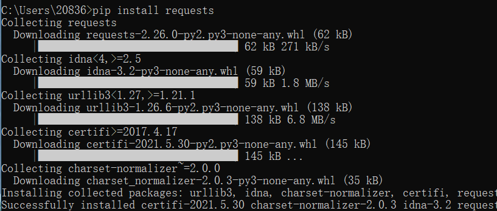


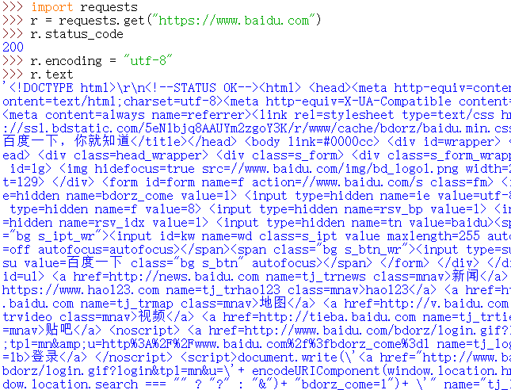

#### 主要方法

| 方法               | 说明                                           |
| ------------------ | ---------------------------------------------- |
| requests.request() | 构造一个请求，支撑以下方法的基础方法           |
| requests.get()     | 获取HTML网页的主要方法，对应于HTTP的GET        |
| requests.head()    | 获取HTML网页头信息的方法，对应于HTTP的HEAD     |
| requests.post()    | 向HTML网页提交POST请求的方法，对应于HTTP的POST |
| requests.put()     | 向HTML网页提交PUT请求的方法，对应于HTTP的PUT   |
| requests.patch()   | 向HTML网页提交局部修改请求，对应于HTTP的PATCH  |
| requests.delete()  | 向HTML页面提交删除请求，对应于HTTP的DELETE     |


### 盗亦有道


#### get方法

获得网页最简单的一行代码是

```python
r = requests.get(url)
```


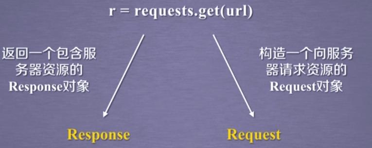


完整形式

```python
requests.get(url, params=None, **kwargs)
```


* url：拟获取页面的url链接
* params：url中的额外参数，字典或字节流格式，可选
* **kwargs：12个控制访问的参数


只有request是基础方法，其他方法都是用request封装的


##### Response对象

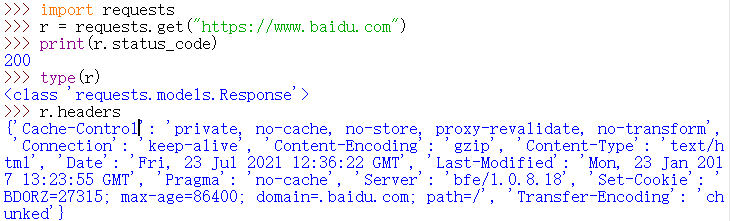

如果状态码`r.status_code`是200，则访问成功，否则访问失败

检测r的类型用`type(r)`

`class`说明是一个类

`r.header`返回get请求获得页面的头部信息


Response对象包含服务器返回的所有信息，同时也包含了我们向服务器请求的request信息，

#####Response对象的属性

| 属性                | 说明                                                       |
| ------------------- | ---------------------------------------------------------- |
| r.status_code       | HTTP请求的返回状态，200表示连接成功，404表示失败           |
| r.text              | HTTP相应内容的字符串形式，即，url对应的页面内容            |
| r.encoding          | 从HTTP header中猜测的响应内容编码方式（从charset字段获得） |
| r.apparent_encoding | 从内容中分析出的响应内容编码方式（备选编码方式）           |
| r.content           | HTTP响应内容的二进制                                       |

比如，从一个url链接上获得一个图片，这个图片里面的资源是以二进制形式存储的，那就可以通过r.content来还原这个图片


所以，当我们用encoding不能正确解码返回内容时，我们要用apparent_encoding来解出相关的编码信息（把apparent_encoding赋予encoding）

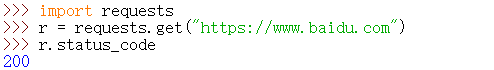

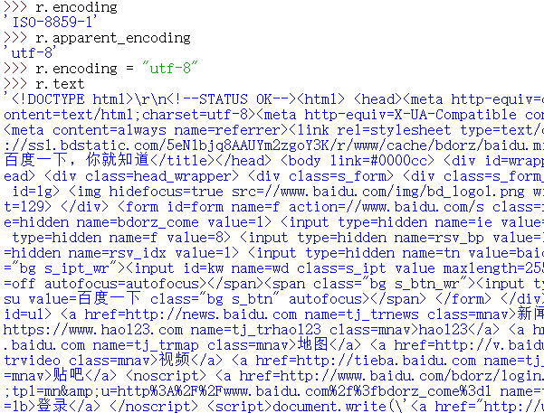


#####流程

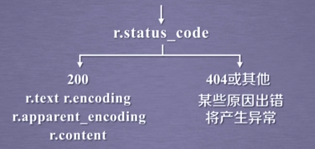


#### 

##### Requests库的异常

| 异常                      | 说明                                        |
| ------------------------- | ------------------------------------------- |
| requests.ConnectionError  | 网络连接错误异常，如DNS查询失败、拒绝连接等 |
| requests.HTTPError        | HTTP错误异常                                |
| requests.URLRequired      | URL缺失异常                                 |
| requests.TooManyRedirects | 超过最大重定向次数，产生重定向异常          |
| requests.ConnectTimeout   | 连接远程服务器超时异常                      |
| requests.Timeout          | 请求URL超时，产生超时异常                   |
| r.raise_for_status()      | 如果不是200，产生异常requests.HTTPError     |


#####爬取网页的通用代码框架

```python
import requests

def getHTMLText(url):
    try:
        r = requests.get(url, timeout = 30)
        r.raise_for_status() #如果状态不是200，引发HTTPError异常
        r.encoding = r.apparent_encoding
        return r.text
    except "产生异常"
    
if __name__ == "__main__":
    url = "http://www.baidu.com"
    print(getHTMLText(url))
```


##### HTTP协议及Requests库方法

###### HTTP协议

```markdown
HTTP，Hypertext Transfer Protocol，超文本传输协议。

HTTP是一个基于“请求与响应”模式的、无状态的应用层协议。

HTTP协议采用URL作为定位网络资源的标识
```

请求与响应模式：简单说，用户发起请求，服务器做相关响应，

无状态：第一次跟第二次请求之间并没有相关的关联

应用层协议指该协议工作在TCP协议之上


```markdown
URL格式  http://host[:port][path]

host  合法的Internet主机域名或IP地址
port  端口号，缺省端口为80
path  请求资源的路径
```


###### HTTP协议对资源的操作

| 方法   | 说明                                                      |
| ------ | --------------------------------------------------------- |
| GET    | 请求获取URL位置的资源                                     |
| HEAD   | 请求获取URL位置资源的响应信息报告，即获得该资源的头部信息 |
| POST   | 请求向URL位置的资源后附加新的数据                         |
| PUT    | 请求向URL位置存储一个资源，覆盖原URL位置的资源            |
| PATCH  | 请求局部更新URL位置的资源，即改变该处资源的部分内容       |
| DELETE | 请求删除URL位置存储的资源                                 |


`HTTP协议通过URL对资源做定位，通过6个常用的方法对资源进行管理，每一次操作都是独立无状态的`


###### PATCH和PUT的区别

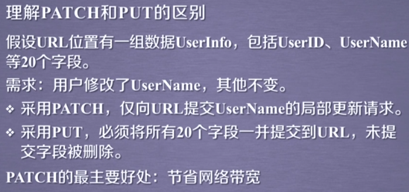


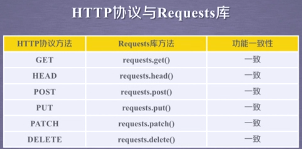


##### head()方法

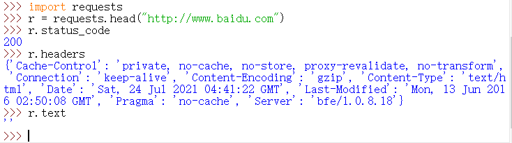

使用`r.text`试图展示全部内容，发现内容是空

用很少的网络流量获取网络资源的概要信息


##### post()方法

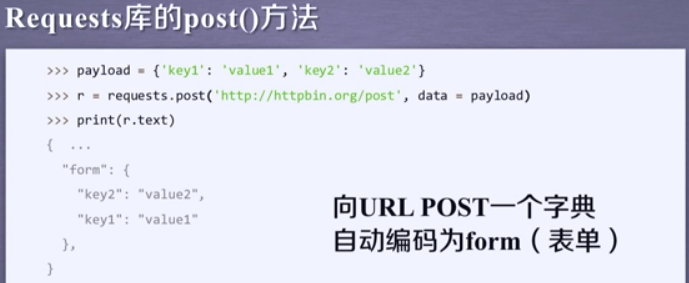


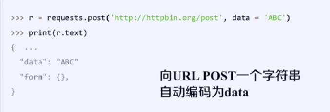


根据用户提交内容的不同，在服务器上会做数据的相关整理


##### put()方法

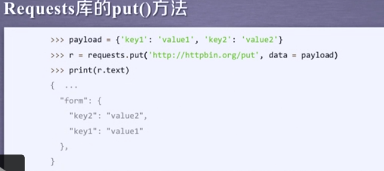


#### Requests库主要方法解析

#####request方法

```markdown
requests.request(method, url, **kwargs)

method   请求方式，对应get/put/post等7种
url      拟获取页面的链接
**kwargs 控制访问的参数，共13个
```

```markdown
method  请求方式

r = requests.request('GET', url, **kwargs)
r = requests.request('HEAD', url, **kwargs)
r = requests.request('POST', url, **kwargs)
r = requests.request('PUT', url, **kwargs)
r = requests.request('PATCH', url, **kwargs)
r = requests.request('DELETE', url, **kwargs)
r = requests.request('OPTIONS', url, **kwargs)
```

OPTIONS是向服务器获取一些服务器跟客户端打交道的参数，这里并不与获取的资源直接相关（用的比较少）


```markdown
**kwargs  控制访问的参数，均为可选项

params    字典或字节序列，作为参数增加到url中
data      字典、字节序列或文件对象，作为Request的内容（向服务器提供或提交资源时使用）
json      JSON格式的数据，作为Request的内容
headers   字典，HTTP定制头
cookie    字典或CookieJar，Request中的cookie
auth	  元组，支持HTTP认证功能
files	  字典类型，传输文件
timeout   设定超时时间，秒为单位
proxies	  字典类型，设定访问代理服务器，可以增加登录认证
allow_redirects		True/False，默认为True，重定向开关
stream	  True/False，默认为True，获取内容立即下载开关
verify    True/False，默认为True，认证SSL证书开关
cert      本地SSL证书路径

```

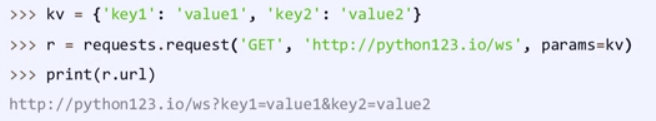

后面多了一个问号，通过这样一个参数，可以把一下键值对增加到url中，那么使得url再去访问时，不止访问的是资源，而同时代入了一下参数，服务器可以接受这些参数，并根据这些参数筛选部分资源。


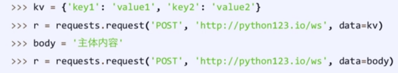

提交的键值对不放在url链接里，而是放在url链接对应位置的地方作为数据来存储

向data域赋值一个字符串，这个字符串存到前面的url链接所对应的位置


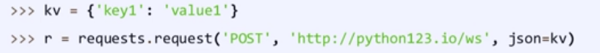

这个键值对赋值到服务器的json域上


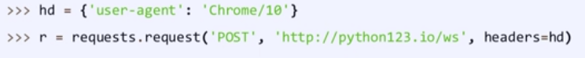

headers是HTTP头的相关域，它对应了向某一个url访问时所发起的HTTP的头字段

简单说，可以用这个字段来定制访问某一个url的HTTP的协议头

上述例子为用字典来修改HTTP协议中user-agent字段，变为Chrome/10（指Chrome浏览器的第10个版本），可以模拟任何我们想模拟的浏览器向服务器发起访问


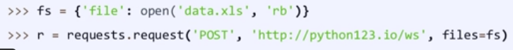

向某一个链接提交某一个文件


如果在timeout时间内，我们的请求内容没有反馈回来，那么它将产生一个timeout异常


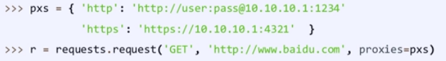


##### get方法(最常用)

```markdown
requests.get(url, params = None, **kwargs)

url		  拟获取页面的url链接
params    url中的额外参数，字典或字节流格式，可选（和request方法的相同）
**kwargs  12个控制访问的参数（request中除了params的其余）
```


##### head方法

```markdown
request.head(url, **kwargs)

url		  拟获取页面的url链接
**kwargs  13个控制访问的参数（和request中的完全一样）
```


##### post方法

```markdown
requests.post(url, data=None, json=None, **kwargs)

url		  拟更新页面的url链接
data	  字典、字节序列或文件，Request的内容
json	  JSON格式的数据，Request的内容
**kwargs  11个控制访问的参数
```


#####put方法

```markdown
requests.put(url, data=None, **kwargs)

url		  拟更新页面的url链接
data	  字典、字节序列或文件，Request的内容
**kwargs  12个控制访问的参数
```


##### patch方法

```markdown
requests.patch(url, data=None, **kwargs)

url		  拟更新页面的url链接
data	  字典、字节序列或文件，Request的内容
**kwargs  12个控制访问的参数
```


##### delete方法

```markdown
requests.delete(url, **kwargs)

url		  拟更新页面的url链接
**kwargs  13个控制访问的参数
```


####网络爬虫引发的问题

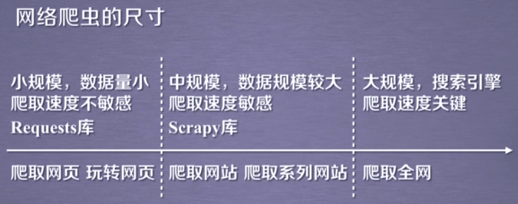


##### Robots协议

```markdown
Robots Exclusion Standard 网络爬虫排除标准

作用：网站告知网络爬虫哪些页面可以抓取，哪些不行。
形式：在网站根目录下的robots.txt文件


```


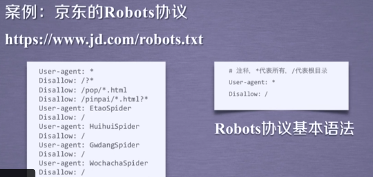


##### 如何遵守Robots协议


### 实例


##Beautiful Soup库

它能够对html和xml格式进行解析，并且提取其中的相关信息

### 安装

打开命令台，输入

```markdown
pip install beautifulsoup4
```


