# 第一周


## Requests库入门


### 安装

打开命令行，输入`pip install requests`即可安装

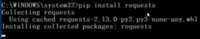

### 测试

`r.status_code`状态码是200表示访问成功

`r.encoding = 'utf-8'`更改它的编码为UTF-8编码

`r.text`打印网页内容

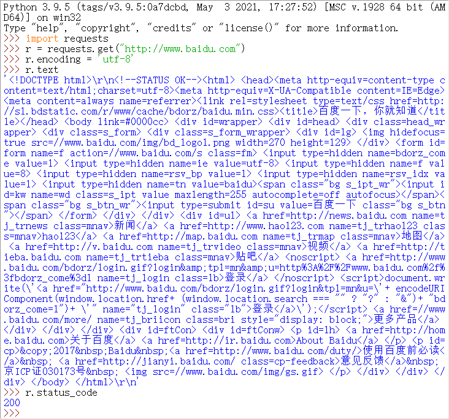

### 主要方法

| 方法                | 说明                                           |
| ------------------- | ---------------------------------------------- |
| requests.requests() | 构造一个请求，支撑以下各方法的基础方法         |
| requests.get()      | 获取HTML网页的主要方法，对应于HTTP的GET        |
| requests.head()     | 获取HTML网页头信息的方法，对应于HTTP的HEAD     |
| requests.post()     | 向HTML网页提交POST请求的方法，对应于HTTP的POST |
| requests.put()      | 向HTML网页提交PUT请求的方法，对应于HTTP的PUT   |
| requests.patch()    | 向HTML网页提交局部修改请求，对应于HTTP的PATCH  |
| requests.delete()   | 向HTML页面提交删除请求，对应于HTTP的DELETE     |

### get方法

这个对象是Requests库内部生成的，

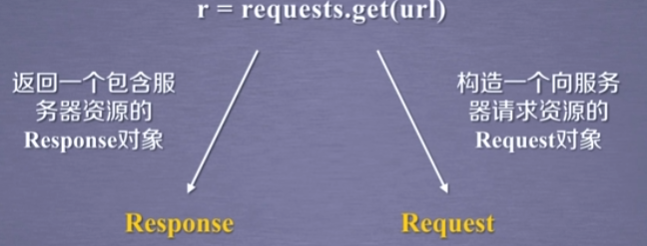

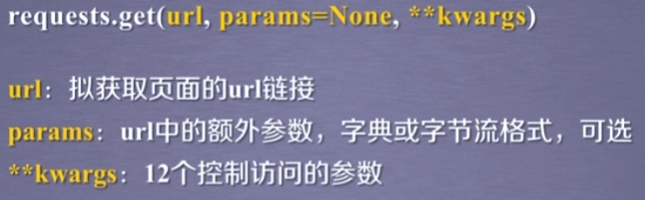

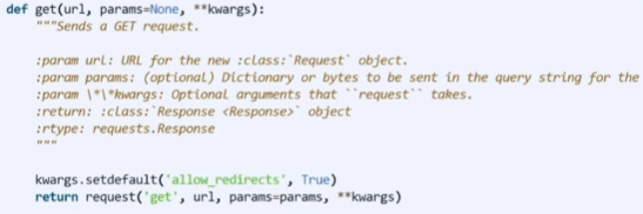

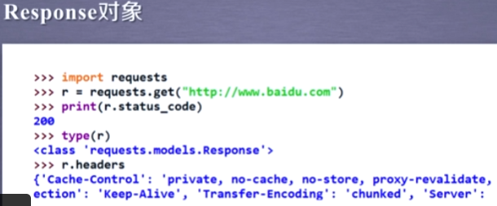

Response对象包含服务器返回的所有信息，同时也包含了我们去向服务器请求的request信息

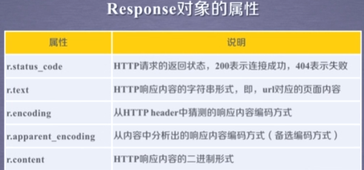

我们从一个url链接上获得一个图片，这个图片里边的资源是以二进制形式存储的，那就可以通过r.content来还原这个图片


流程

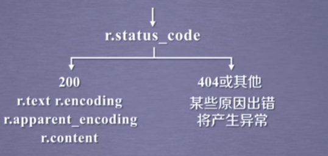

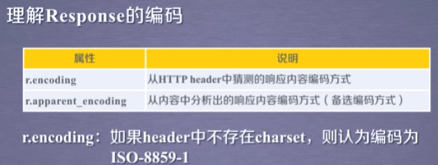

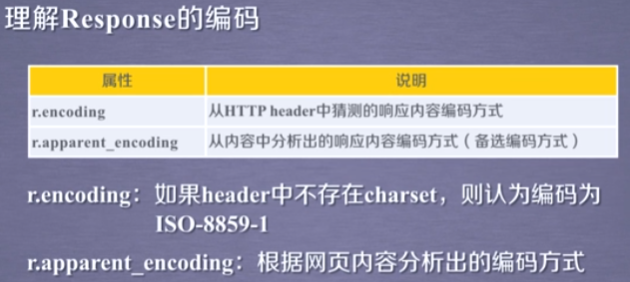

### 爬取网页的通用代码框架

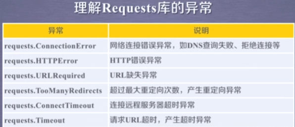


Response对象的属性

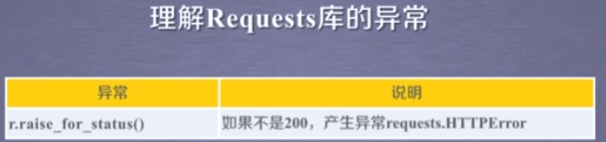

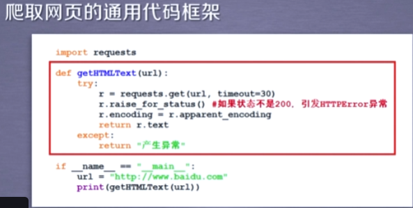

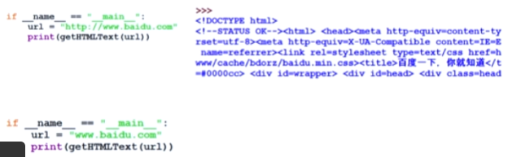


### HTTP协议及Requests库方法

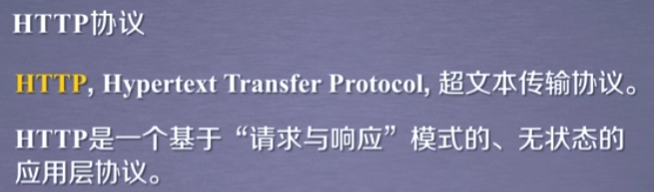

请求与响应的模式：用户发起请求，服务器做出相关响应

无状态：第一次请求与第二次请求之间并没有相关的关联

应用层协议指该协议工作在TCP协议之上

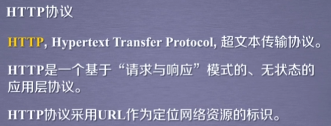

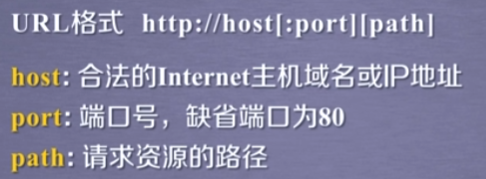

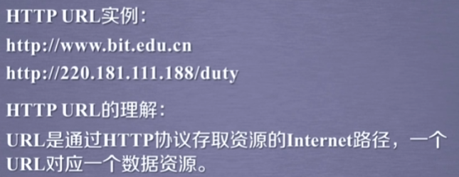

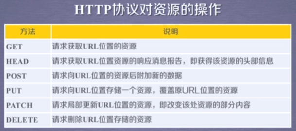

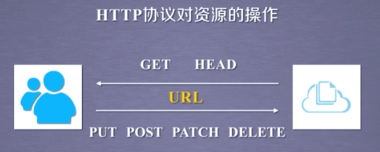

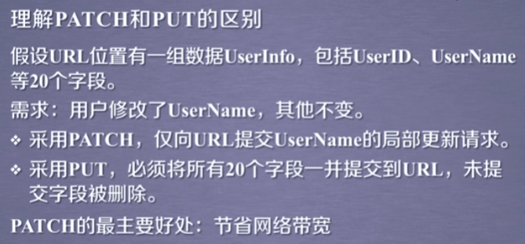

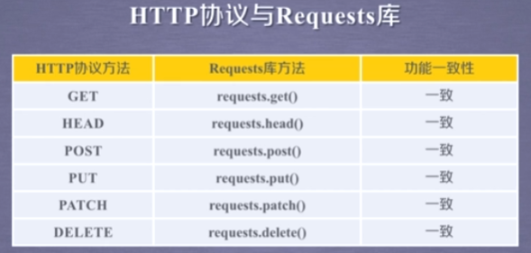

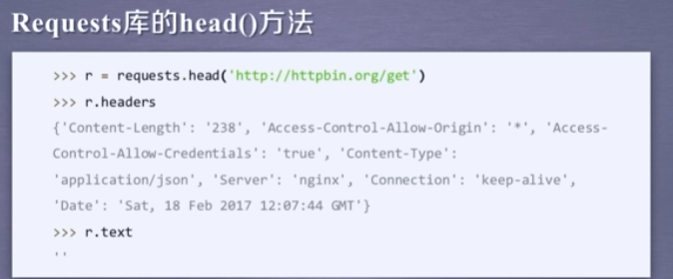

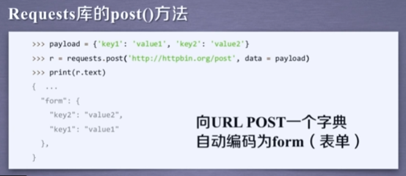

当我们向url，post一个字典或者键值对的时候，那么键值对默认存储到表单的字段下

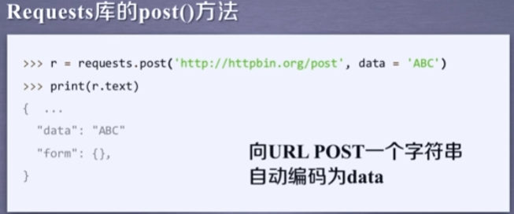

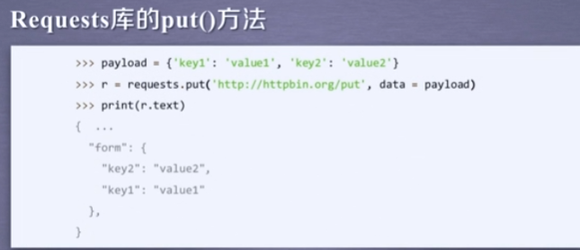


### Requests库主要方法解析

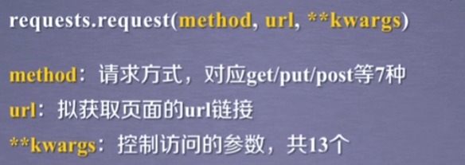

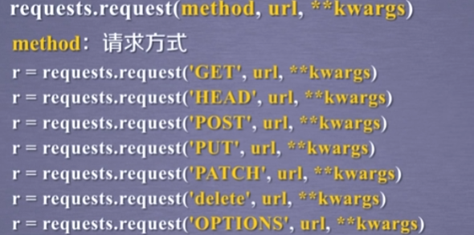

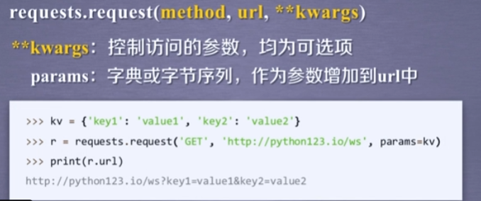

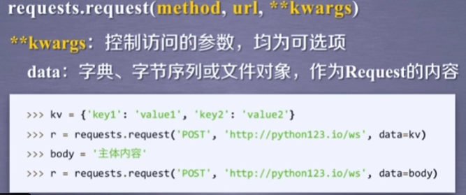

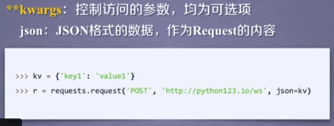

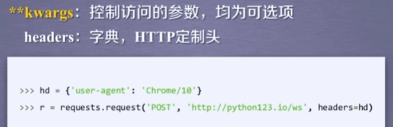

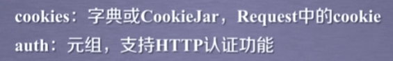

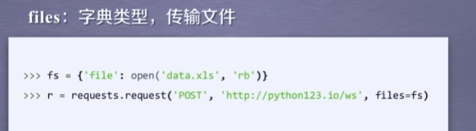

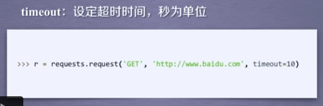

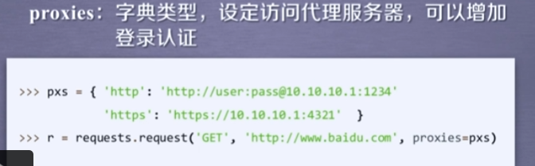


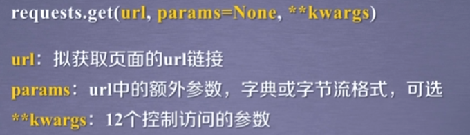

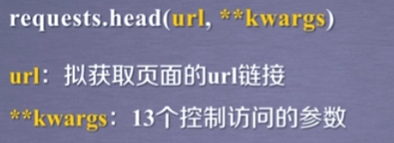

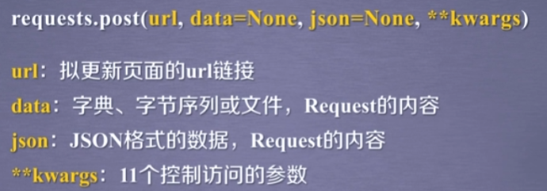

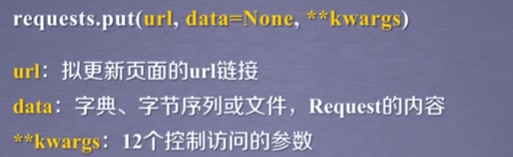

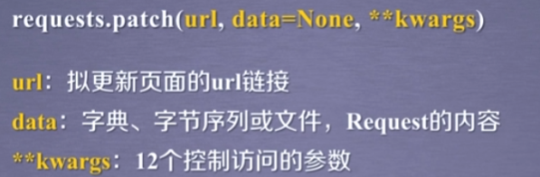

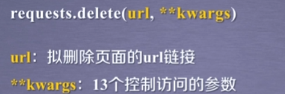

## 网络爬虫的“盗亦有道”

### 网络爬虫引发的问题

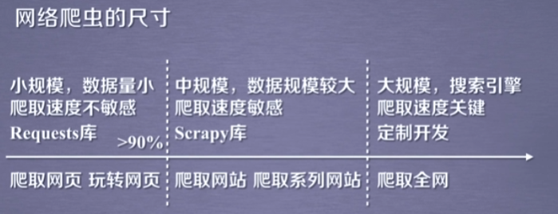

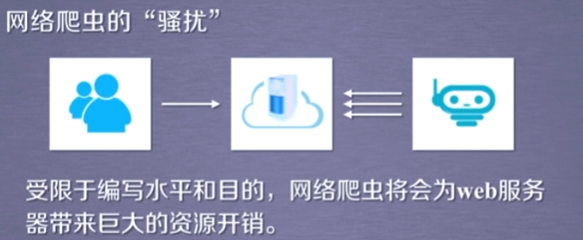

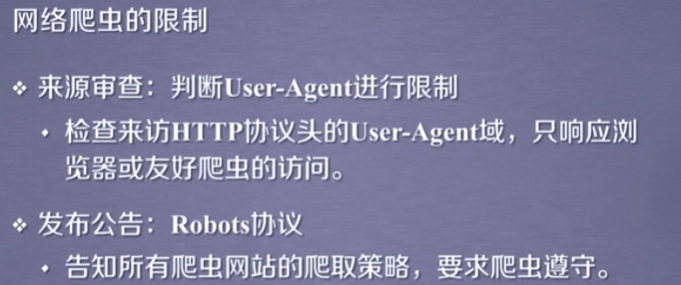


### Robots协议


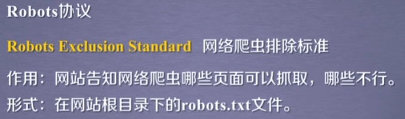


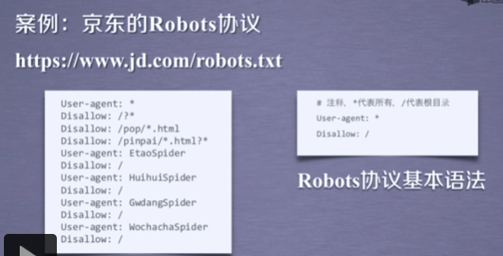

### Robots协议的遵守方式

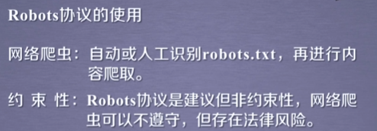

## Requests库网络爬虫实战

通过`r.request.headers`查看发给网站的request信息的头部是什么内容


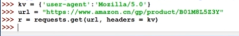

 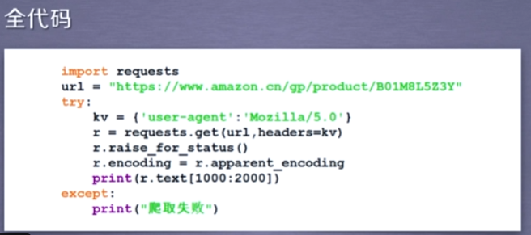

### 百度360搜索关键词提交


### 网络图片的爬取和存储


图片是以`.jpg`结尾的，那说明它就是一个图片链接，而且它是一个文件，


以二进制形式打开了一个文件，这个文件就是我们要存储的abc.jpg，并且把它定义为一个文件标识符f，然后将返回的内容写到这个文件中，r.content表示返回内容的二进制，最后将文件关闭


### IP地址归属地的自动查询


# 网络爬虫之提取

## BeautifulSoup库入门

### 安装

该库能够对html、xml格式进行解析，并且提取其中的相关信息

打开控制台，输入`pip install beautifulsoup4` 


从bs4库导入了一个类叫做BeautifulSoup

给出一个解析demo的解释器，这里解释器使用的是html.parser，也就是对demo进行html的解析


 


###BeautifulSoup库的基本元素


 


任何存在于html语法的标签都可以使用`html.tag`的方式打印出来，当文档存在多个相同标签时，返回的是第一个


可以跨越标签


```html
<b><!--This is a comment--></b><p>This is not a comment</p>
```


### 基于bs4库的HTML内容遍历方法


迭代类型只能用在for循环中


html是最高级标签，它的父亲就是自己


soup标签没有父亲


在标签树中，标签之间的NavigableString也构成了标签树的结点


### 基于bs4库的HTML格式输出


prettify能够为html文本的标签以及内容增加换行符，也可以对每一个标签来做相关的处理


bs4库将任何读入的html文件或字符串都转换成了utf-8编码，


## 信息组织与提取


### 信息标记的三种形式


国际公认的信息标记种类，有三种形式，分别是XML、JSON和YAML


标签中没有内容


键和值都要加双引号来表达它是字符串的形式，如果值是数字，则可以直接写


有多个值时


键值对之间可以嵌套使用，


键和值都没有双引号的形式

通过缩进的方式来表示所属关系


YAML用减号表达并列关系


### 三种信息标记形式的比较


 


JSON格式是用在程序对接口处理的地方，JSON数据在经过传输之后能够作为程序代码一部分并被程序直接运行，这样JSON格式中对信息类型的定义才能最大的发挥作用。缺陷是无法体现注释


### 信息提取的一般方法

信息标记中包含标记和信息两部分


 


### 基于bs4库的HTML内容查找方法


同时查找a标签和b标签，这时两者以列表形式给第一个参数


如果给出的标签名称是True，将显示当前soup的所有标签信息


可以检索某一个标签对应的属性中是否包含了某些字符信息


属性赋值查找，例如查找id属性等于link1的值


默认情况搜索的是从某一个标签开始的后续所有子孙结点的信息，如果我们只想搜索当前结点儿子这一层面的结点信息，我们可以将recursive置为False

从soup的根结点开始，它的儿子结点层面上是没有a标签的


## 中国大学排名的爬虫


# 实战


## Re（正则表达式）库入门


### 概念


正则表达式表示了一组字符串的特征或模式


### 语法


{m, n}中的m不写是默认为0


### Re库的基本使用


只要安装了python的解释器，就可以使用标准库而不用额外安装


原生字符串中的斜杠`\`不被解释为转义符


在使用时一定要判断match是不是空的


匹配的部分去掉，去掉之后的部分分别作为分割的字符串元素放到一个列表里


regex才是正则表达式，代表了一组字符串


传入参数只是需要匹配的字符串


### Re库的Match对象


### Re库的贪婪匹配和最小匹配


当有操作符可以匹配不同长度的时候，都可以在操作符的后面增加一个？，来获得最小匹配的结果。


## 淘宝商品比价定向爬虫


书包是我们输入的关键词，q是引入关键词的变量，前面可以作为向淘宝提交关键词的链接接口


s表示每一页的起始商品的编号


返回的页面中，每一个页面都是不同的url，下一页就会有下一个url，因此对每一个页面进行单独的访问和处理


如果某一个页面解析出现了问题，那么我们继续下一个页面的解析，而不影响程序的整个执行


需要手工判断`r.encoding`是否能获得文件的编码信息


淘宝商品查询信息返回的价格由`view price`字段来标识，而商品的名字由`raw title`字段来标识。因此如果我们想获得这两个信息，只需要在获得的文本中检索到其中的`view price`和`raw title`并把后续的相关内容提取出来即可。从众多的文本中提取我们想要的信息用正则表达式是非常合适的工具


eval函数能够将我们获得的字符串的最外层的双引号或单引号去掉，